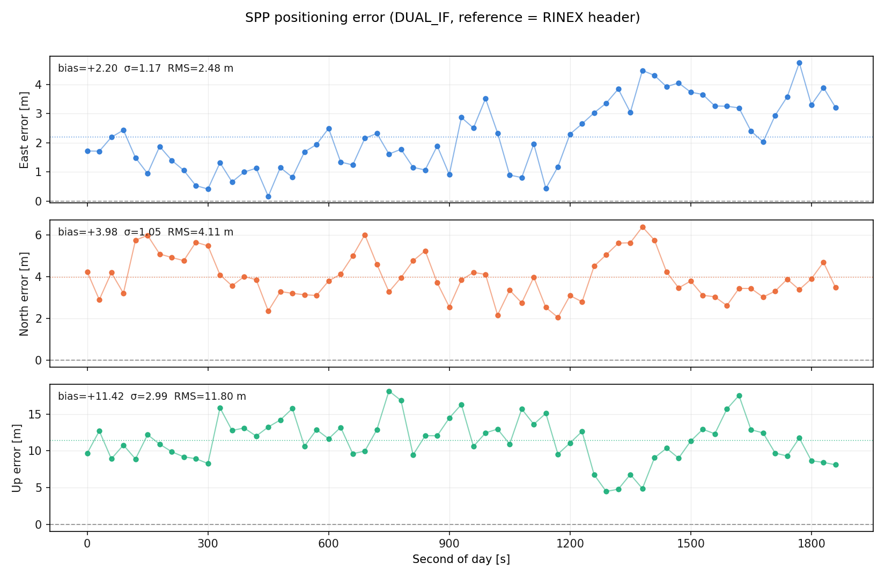
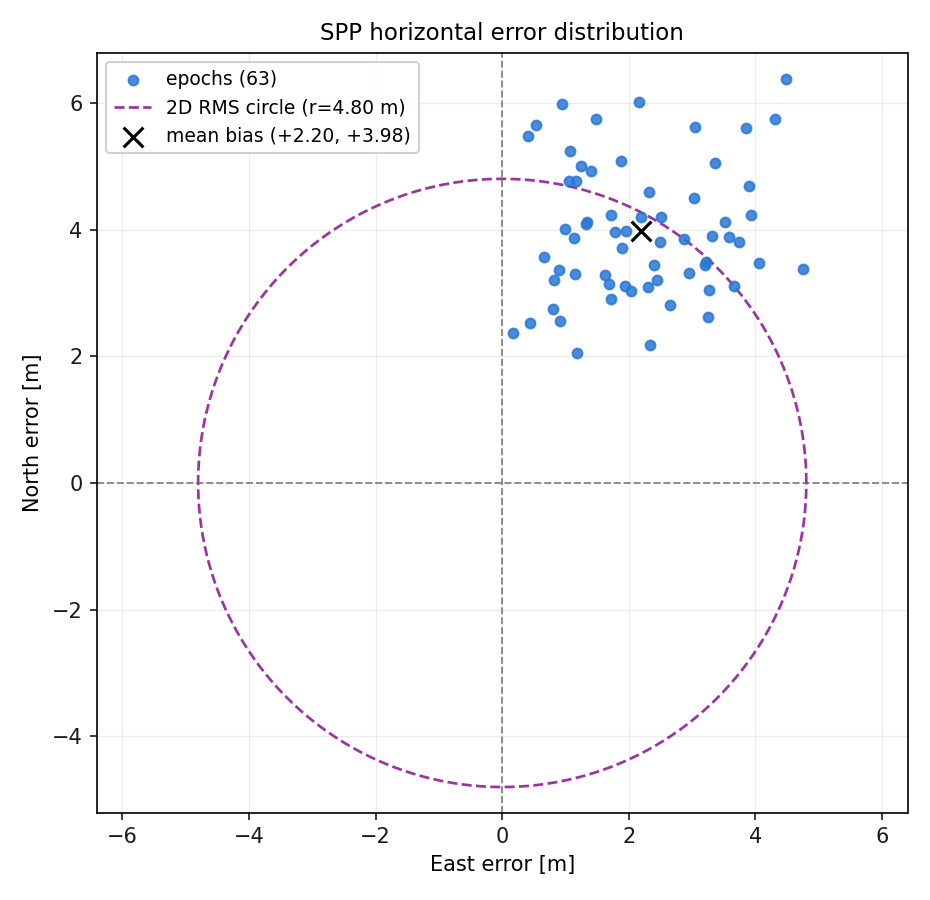
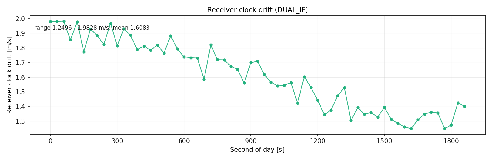

# GnssLab

**一套 GNSS 数据处理系统：C++20 引擎负责单点定位与多普勒测速，Python 层负责精度分析与出图。**

读取 RINEX 观测文件与广播星历文件，逐历元解算测站位置与接收机钟差，由多普勒观测
估计接收机速度，并给出可复现的精度评估与图表。

[English](README.md) · [架构说明](docs/architecture.md) · [数据格式](docs/data-format.md) · [命令行](docs/cli.md) · [路线图](docs/roadmap.md)



<p align="center">
  
  
</p>

---

## 结果

测站 **WUH2**（武汉），2025-01-01，GPS + 北斗，采样率 30 s，共 63 个历元
（00:00:00–00:31:00 UTC）。测站静止，故测速真值严格为零。

**测速** —— 基于多普勒观测，达到米/秒量级：

| 分量 | 均值偏差 | 内符合 σ | 外符合 RMS |
|---|---|---|---|
| vE 东向 | −0.008061 m/s | 0.005828 | 0.009920 |
| vN 北向 | +0.001240 m/s | 0.005055 | 0.005165 |
| vU 天向 | −0.002883 m/s | 0.017616 | 0.017712 |
| 水平 2D | | | 0.01118 m/s |
| 三维 3D | | | 0.02095 m/s |

接收机钟漂 1.2496–1.9828 m/s，均值 1.6083 m/s，约合 5.4 × 10⁻⁹ s/s，
属普通晶体振荡器的正常漂移水平。

**定位** —— 相对 RINEX 表头坐标：

| 分量 | 均值偏差 | 内符合 σ | 外符合 RMS |
|---|---|---|---|
| E 东向 | +2.197 m | 1.165 m | 2.483 m |
| N 北向 | +3.979 m | 1.050 m | 4.113 m |
| U 天向 | +11.419 m | 2.992 m | 11.799 m |

### 如何理解这些数字

**σ（内符合）** 是序列相对自身均值的标准差（`ddof=1`），衡量的是**精度**（重复性），
不受系统性偏差影响。

**RMS（外符合）** 是相对参考值的均方根误差，包含系统性偏差，因此恒 ≥ σ。

测速的参考值精确（静止测站不移动），所以上表测速部分是真正的准确度指标。

定位的参考值是 RINEX 表头的 `APPROX POSITION XYZ`，**其本身只有米级到十米级精度**。
本次均值解与该参考值相差 (−5.22, +6.21, +9.23) m，因此上表定位 RMS 是「重复性 + 参考
坐标偏差」的合成量，**不等于绝对精度**。内符合 σ 不受此影响，才是这里真正反映精度的
指标。要做严格的绝对精度评定，需要引入 IGS `.snx` 已知坐标——见路线图。

天向 σ 约为水平方向的 3 倍，这是单点定位的正常表现，源于卫星几何构型。

## 快速开始

需要：C++20 编译器（GCC 11+ / Clang 14+ / MSVC 19.3+）、CMake 3.20+、
Python 3.9+ 及 numpy、matplotlib。若装了 Ninja 会自动使用。

```bash
git clone https://github.com/nsq-dot/GnssLab.git && cd GnssLab

cd python && pip install -e . && cd ..   # 注册 `gnss` 命令
gnss build                               # 配置并编译全部 13 个目标
gnss demo                                # 用自带样例数据跑通全流程并出图
```

`gnss build` 会自行查找 CMake 与 Ninja，包括那些**不在 PATH 上的 IDE 内置副本**。
若仍找不到，可设置 `CMAKE_EXE`，或改用 `scripts/build.sh`（查找逻辑相同）。

`gnss demo` 无需任何参数、无需下载数据——它跑仓库内自带的 2.7 MB 样例，
把报告和四张图写到 `output/demo/`。

不想安装 Python 包时：

```bash
scripts/build.sh
PYTHONPATH=python/src python -m gnss_plot.cli demo
```

## 用自己的数据

```bash
# 1. 把 RINEX 文件放进 data/，并在配置里指向它们
$EDITOR config/spp.ini

# 2. 解算
gnss spp config/spp.ini

# 3. 分析与出图
gnss plot --rinex data/你的观测文件.rnx --out-dir output
```

一步完成：`gnss run config/spp.ini`。

命令行选项优先于配置文件：

```bash
gnss spp config/spp.ini --stop 2025-01-01T12:00:00 --gps-only --verbose
```

详见 [docs/cli.md](docs/cli.md) 与 [`config/README.md`](config/README.md)。

## 功能范围

**已实现**

- 双频无电离层组合伪距加权最小二乘单点定位（GPS L1/L2、北斗 B1I/B3I）
- 基于多普勒的接收机测速，独立的最小二乘解算，并以 MAD（中位数绝对偏差）尺度做稳健粗差剔除
- 广播星历：GPS 与北斗，含北斗 GEO 卫星的专用轨道旋转处理
- 高度角截止、Hopfield / Saastamoinen 对流层改正、北斗 TGD 改正
- Melbourne–Wübbena 周跳**探测**
- 系统误差诊断：TGD、电离层与对流层延迟
- 广播星历与精密轨道/钟差（SP3/CLK）对比
- 配置文件、命令行与统一的 `gnss` 入口

**未实现**（明确列出，免得你去源码里猜）

- **无 RTK、无 PPP。** 没有载波相位相对定位。第 8 章那部分代码
  （`ARLambda`、`SolverKalman`、`KalmanFilter`）仍在库里且能编译，但没有程序调用。
- **无卡尔曼滤波。** `estimator = 2` 能解析但被忽略，解算恒用最小二乘。
- **不支持 Galileo 与 GLONASS。**
- **只探测周跳，不做修复。**

完整清单（含已知问题与后续建议）见 [`docs/roadmap.md`](docs/roadmap.md)。

## 整体结构

```
  RINEX 观测/星历 ─┐
  SP3 精密轨道     ├─►  C++20 引擎  ─►  *.out + manifest.json  ─►  Python 层  ─►  报告 + PNG
  CLK 精密钟差     ┘     数值计算         接口契约                 分析出图
```

C++ 侧负责全部数值计算并以纯文本输出，Python 侧读取该文本，两者互不 import。
这样解算结果可以用常规工具查看、比对、归档，且任一侧改动都不需要重新编译另一侧。

`gnss` 命令行放在 Python，是因为它必须同时驱动两侧——而两者的接口是**文件**而非
函数调用。`build/bin/` 里的 C++ 可执行文件完全可以单独使用。

取舍理由与被否决的方案见 [docs/architecture.md](docs/architecture.md)。

## 目录结构

| 目录 | 内容 |
|---|---|
| `src/` | GNSS 库，18 个编译单元，编译为静态库 `gnss` |
| `apps/` | 7 个正式程序，含 `spp_if` |
| `examples/` | 6 个交互式教学示例，无需数据 |
| `python/` | `gnss_plot` 包与 `gnss` 命令行 |
| `config/` | 解算配置档 |
| `data/` | 数据，仅提交 2.7 MB 样例 |
| `tests/` | 三层测试与冻结的回归基线 |
| `docs/` | 架构、格式、命令行、配置、路线图 |
| `scripts/` | 构建、样例生成、数据下载 |
| `thirdparty/` | Eigen 3.4.0，仅头文件 |

## 测试

```bash
python tests/test_plot_utils.py             # 无需数据、无需编译
python tests/test_baseline_numerics.py      # 无需数据
python tests/test_regression_pipeline.py --required
```

第三项用样例数据跑通完整链路，并要求输出与 `tests/baseline/` **逐字节一致**——
这是「改动没有影响任何数值」的最强证明。前两项在刚 clone 下来、尚未下载 500 MB
数据时即可运行，不会让贡献者看到一个没有意义的报错。详见
[`tests/README.md`](tests/README.md)。

## 数据

`spp_if` 需要一个 RINEX 观测文件和一个广播星历文件。两者都不入库，仓库里只有
裁剪过的样例。获取完整产品：

```bash
python scripts/download_data.py --product all --date 2025-01-01
```

也可从任意 IGS 数据中心手动下载——产品清单、目录结构与测站信息见
[`data/README.md`](data/README.md)。

## 项目背景

本项目基于 **gnssLab-2.4** 教学框架开发，原作者为武汉大学测绘学院张守建
（Shoujian Zhang），框架提供了基础库与按课程章节组织的示例结构。北斗星历处理、
多普勒测速、配置系统、精度分析与出图层，以及本次的工程化重构，均为在此基础上
新增的工作。

来自框架的部分保留原有署名；新增内容列于 [`NOTICE`](NOTICE)——这也是
MulanPSL-2.0 对修改版本的要求。各程序与课程章节的对应关系见
[`docs/chapter-mapping.md`](docs/chapter-mapping.md)。

## 许可

[MulanPSL-2.0](LICENSE)（木兰宽松许可证第 2 版），与上游源码文件中已有的许可声明
一致。

`thirdparty/eigen-3.4.0` **不在**该授权范围内：Eigen 主要采用 MPL-2.0，部分文件为
BSD、LGPL 与 Apache 许可。详见 [`NOTICE`](NOTICE) 第 3 节与
`thirdparty/eigen-3.4.0/COPYING.README`。

## 引用

```bibtex
@misc{gnsslab2025,
  title  = {GnssLab: 单点定位与多普勒测速},
  author = {吴东昊},
  year   = {2025},
  note   = {基于武汉大学 gnssLab-2.4 教学框架（张守建）},
  url    = {https://github.com/nsq-dot/GnssLab}
}
```
