# 第7章 周跳探测：MW 组合的问题与 GF 组合的实现

本文对应课程第 7 章（周跳探测）及其课后三道习题。内容包括：对老师给出的
MW 组合示例程序 `apps/cs_detect_mw.cpp` 的可行性检查、按教材 7.3 节实现的
载波相位几何无关（GF）组合探测器、以及用注入已知周跳的方式对三种探测器做的
定量验证。

三道习题按 **1 → 3 → 2** 的顺序展开：习题1 与习题3 各实现一个探测器，
习题2 要同时检验这两个探测器，逻辑上只能排在它们之后。老师给的 MW 程序则是
**第三个探测器**，贯穿全文——程序问题在 §一，原理在 §二，性能在 §六，
与 GF 的互补关系在 §七。

实现落在：`src/GnssFunc.cpp` 的 `detectCSGFdiff` / `detectCSGFpoly`，
程序 `apps/cs_detect_gf.cpp`，配置 `config/cs.ini`，
注入与评分工具 `scripts/inject_cycle_slips.py` / `scripts/check_cycle_slips.py`，
以及出图的 `gnss cs-plot`（`python/src/gnss_plot/cycleslip.py` 与 `figures.py`）。
本文的 11 张插图由该命令生成，见 §九。

---

## 一、`cs_detect_mw.cpp` 可行性检查

**结论：算法与数据结构是对的，接线全坏，程序根本跑不起来。**

实际运行 `build/bin/cs_detect_  mw.exe` 的输出：

```
D:\GnssLab\data\Zero-baselineoem719-202203031500-1.obs
rinex file open error!No such file or directory
```

逐条列出的问题：

| # | 位置 | 问题 | 后果 |
|---|---|---|---|
| 1 | `apps/cs_detect_mw.cpp:14` | 目录串结尾缺 `\\` | **致命**，拼成 `Zero-baselineoem719-…`，开文件即 `exit(-1)` |
| 2 | `apps/cs_detect_mw.cpp:40-43` | BDS 选 `C6I/L6I`，而文件里 BDS 只有 `C2I/L2I/C7I/L7I` | 过滤后 BDS 没有 L7/C7，`detectCSMW` 的 BDS 分支 `.at()` 抛异常 → **BDS 一颗也探测不到** |
| 3 | `src/GnssFunc.cpp:647-649` | 裸 block `{ badSatSet.insert(sat); }`，本意是 `else` | **每颗星都被标坏星**，函数末尾清空 `obsData.satTypeValueData` |
| 4 | `apps/cs_detect_mw.cpp:31` | 硬编码停止历元 | 数据 06:48:37–09:02:58，停在 07:00 截掉两小时 |
| 5 | `apps/cs_detect_mw.cpp:93` | 结果写回**输入目录** | 污染 `data/`，`G01…G30` 就是这么产生的 |

另有三个**库层**的 bug，是同一类错误，都会让整条自由函数读取路径失效：

| 位置 | 问题 |
|---|---|
| `src/GnssFunc.cpp` `parseRinexHeader` | `strip(label);` 丢弃了返回值。`strip` 是 `inline string strip(std::string s)`，**按值传参、返回新串**，所以 `"END OF HEADER       "` 永远不等于 `"END OF HEADER"`，循环跑到文件尾后在 EOF 上空转（实测打印了无穷多空行） |
| 同上，`SYS / # / OBS TYPES` 分支 | 观测类型数只写在第一行，续行时 `numObs` 是**未初始化变量**（UB）。实测结果：超过第 13 个的观测类型全部丢失 |
| 同上，label 提取 | `if (line.size() >= 80)` 要求整行满 80 字符。`scripts/make_sample_data.py` 会去掉行尾空白，导致 `END OF HEADER` 那行只有 73 字符，标签根本提取不出来 |

第三条的影响面最大：**入库的样例数据 `data/sample/` 用原来的代码完全读不了**。
前两条则使得 GPS 的 `L2W`（第 16 个类型）和 BDS 的全部相位类型丢失，
结果是一颗能构成组合的卫星都不剩。1 Hz 零基线需要的几个码
（GPS 的 `C1C/L1C/C2W/L2W`、BDS 的 `C2I/L2I/C7I/L7I`）**全落在第 13 个之内**，
所以它没被这一条打中——两套数据的故障表现不同，根源就在这里。

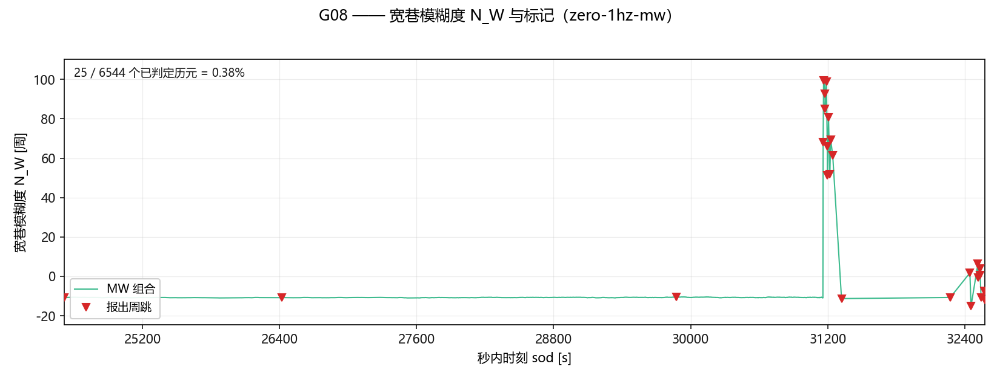

**图 7-1**　修复后的探测器在 1 Hz 零基线上跑出的完整一段（G08，6544 个历元）。
绿线是宽巷模糊度 `N_W`，红三角是它报出周跳的历元，左上角是标记比例（25 / 6544 = 0.38%）。
组合值就是宽巷模糊度，除周跳外应当是一条水平线：全程 p95 − p5 只相差 0.33 周，
`sod ≈ 31160` 处有一次 79 周的大跳变，前后另有若干孤立历元被报出。

**MW 图按周、GF 图按米**，两者单位不同是有意的。MW 组合除以宽巷波长 `λ_W`
（GPS 0.8619 m、BDS 0.8470 m）就得到整周模糊度 `N_W`，除周跳外它是整数，
所以按周画才能和本文的注入表（`(77, 60)`、`(1, 1)` …）和盲区结论（`(k, k)`）
直接对照。GF 则相反：`L_I = λ₁N₁ − λ₂N₂ + I`，对任何波长都不是整数倍，
电离层项 `I` 本身又是以米计的，标成"周"会暗示一个它并不具备的周期性。
选 G08 是看完这颗星所在的整个 1 Hz 运行后定的：弧段干净的星（G01、G07、G21）
全程只有 2 个弧段首标记，画出来是一条毫无标记的直线；低仰角噪声大的星
（G14、C03）组合值自身在几十周范围内摆动，标记成片糊在一起。G08 是两者之间
唯一既平直、标记又沿时间散开的一颗。§一 只需要它证明**程序跑得起来**。

修复后 `cs_detect_mw` 能够正常出结果。
改动全部集中在自由函数路径；`spp_if` 用的是 `RinexObsReader`，
两条路径独立，**SPP 回归基线逐字节未变**（`tests/` 与
`scripts/make_sample_data.py --verify` 均通过）。

修好之后 `cs_detect_mw` 才成为一个可用的探测器。本节只回答"能不能跑"，
它跑出来的结果在 §六，与 GF 的互补关系在 §七。

### 尚未修复、需要记录的一处

`src/RinexObsReader.cpp:67` 有完全相同的 `strip(sysStr);` 丢弃返回值问题，
连带的后果是 GPS 的观测类型只解析前 13 个。`spp_if` 目前**恰好**只用前 13 个
之内的 `C1C/C2W/D1W…`，所以基线正常；但只要有人调整 `selectedTypes` 选到
第 14 个以后的类型，就会静默出错。因为这条路径有冻结基线，本次未动，
记在 `docs/roadmap.md`。

---

## 二、GF&MW组合的原理与固有盲区

GF 与 MW 是两条独立的探测路线，**各自的构造决定了各自的盲区**。本节先讲
GF 的构造与量级，再讲 MW 的构造，最后把两个盲区并列——它们不重合，这是
全文最关键的结论，§六 与 §七 的实验都是在证实它。

### GF 组合：原理与量级

教材 (7.6)–(7.9)：

```
L_I  = L1 - L2                                    (7.6)
     = (γ-1)·I1 + λ1·N1 - λ2·N2                   (7.7)   γ = f1²/f2²
ΔL_I = (γ-1)·ΔI1 + λ1·ΔN1 - λ2·ΔN2                (7.8)
ΔL_I ≈ λ1·ΔN1 - λ2·ΔN2      （电离层平稳时）        (7.9)
```

实现中相位在入库时已换算成**米**（`GnssFunc.cpp:203-204`，`data = data * wavelength`），
因此 `L_I = L1 - L2` 直接相减即可，单位是米。

**符号必须保持 `L1 - L2`。** 系数是 `+λ1` 和 `-λ2`：

| ΔN1 | ΔN2 | ΔL_I (GPS) |
|---|---|---|
| 1 | 0 | +0.1903 m |
| 0 | 1 | −0.2442 m |
| **1** | **1** | **−0.0539 m** ← 最小非零响应 |
| 10 | 10 | −0.5392 m |
| **77** | **60** | **0.000 m** ← 零空间，见下 |

关键常数：

| | f1/f2 (MHz) | γ−1 | λ1 (m) | λ2 (m) | \|λ1−λ2\| (m) |
|---|---|---|---|---|---|
| GPS L1/L2 | 1575.42 / 1227.60 | 0.6469 | 0.190294 | 0.244210 | **0.053917** |
| BDS B1I/B2I | 1561.098 / 1207.14 | 0.6724 | 0.192039 | 0.248349 | **0.056310** |

#### 电离层项决定了 GF 能不能用

漏检和虚警都取决于 `(γ-1)·ΔI` 有多大。GPS 的 `γ-1 = 0.6469`，1 TECU 在 L1 上
是 0.16237 m，再乘高度角映射因子（天顶 1.00、15° 仰角 2.49）：

| 电离层变化率 | 1 Hz 每历元 | 30 s 每历元 |
|---|---|---|
| 0.2 TECU/min（平静） | 0.9 mm | **26 mm** |
| 0.5 TECU/min（中等） | 2.2 mm | **65 mm** |
| 1.0 TECU/min（活跃） | 4.4 mm | **131 mm** |

对比最小周跳响应 53.9 mm：**1 Hz 下电离层项只有它的 1/50，一次差分完全可用；
30 s 下平静期就到它的一半，中等活动就全面超过它。** 这就是教材 (7.9) 那句
"电离层变化平稳时"没有明说的量化条件，也是本实验两份数据给出不同结论的根本原因。

#### 阈值必须低于待检信号

教材说最小可探测值是 5.4 cm，但**不能把阈值设成 5.4 cm**——阈值设在信号幅度上，
对恰好这么大周跳的检出率只有约 50%（统计量本身有噪声，正负各占一半）。
本实现取 **0.030 m = 0.56 × 0.0539**，即"把阈值放在最小待检信号的一半处"。

另一处不能照抄 MW 的地方：MW 的阈值写成 `minCycles(2.0) × wavelengthOfMW(0.862) = 1.72 m`（即 2 周），
如果照搬到 GF 上会得到 `2.0 × 0.0539 = 0.108 m`，**是最小周跳的两倍**，
恰好把最该检出的那批周跳全部漏掉。GF 的阈值是绝对米值，与波长无关。

#### GF 的固有盲区

GPS 有 `f1/f2 = 1575.42/1227.60 = 77/60` 精确成立，于是 `77·λ1 = 60·λ2`，
`ΔL_I = 0`。**GF 组合对 `(ΔN1, ΔN2) = (77k, 60k)` 原理上完全无响应**，
不是算法不够好，是观测量本身不包含这个方向的信息。零基线实验里专门注入了
一组 `(77, 60)` 来验证这一点，结果见 §七。

### MW 组合：原理与固有盲区

MW（Melbourne-Wübbena）组合是**宽巷相位减窄巷伪距**，`src/GnssFunc.cpp:733-735`：

```
N_W = (f1·L1 − f2·L2)/(f1 − f2)  −  (f1·P1 + f2·P2)/(f1 + f2)
```

第一项是宽巷相位、第二项是窄巷伪距。两者相减使**几何项与电离层项同时消掉**，
剩下的核心量是宽巷模糊度 `N_W = N1 − N2`。这是它相对 GF 的长处：GF 里
`(γ−1)·ΔI` 是主要误差源，MW 里根本没有这一项，所以它对电离层不敏感。

代价是判据只用到 `N_W = N₁ − N₂` 这一个方向：**当 `ΔN₁ = ΔN₂` 时 `ΔN_W = 0`，
等量周跳在组合里正好抵消**，MW 对此完全没有响应。§五 的表证实，MW 漏掉的
用例全部落在这条线上。

### 两个盲区互为补集

| | 组合 | 盲区 | 原因 |
|---|---|---|---|
| GF | `L₁ − L₂` | `(77k, 60k)` | `77λ₁ = 60λ₂` |
| MW | `N_W = N₁ − N₂` | `(k, k)` | `ΔN₁ − ΔN₂ = 0` |

**两个盲区不重合**，所以谁也无法单独覆盖全部周跳，必须并行跑、取并集。
这两行现在是原理上的推断，§六 与 §七 用实测把它们落实。

---

## 三、习题1：基于历元间一次差分的 GF 组合

### 判据

统计量是相邻历元的差分：

```
dL_I(i) = L_I(i) - L_I(i-1)
bias    = |dL_I(i) - meanDL(i-1)|
T       = max( 4·√2·σ_DL , 0.030 )
```

`meanDL` / `σ_DL` 用与 MW 相同的递推式逐历元更新，用于适应噪声水平。

**为什么带 √2：** MW 的统计量是"电平"，一次观测的噪声就是统计量的噪声；
GF 的统计量是**两个相邻样本之差**，方差翻倍。照抄 MW 的 `4·σ` 会让探测器
比设计值敏感 41%。

### 弧段首历元与数据中断不做判定

教材 7.2 节把"首历元""数据中断""真周跳"都归为需要标记的情形，
MW 示例程序把它们一律记成 `csFlag = 1`。但**首历元在结构上不可能是周跳**
（没有参考量可比较），一律标记会让每颗卫星的第一个历元都成为假阳性，
使检出率和虚警率根本无法统计。

本实现用五态编码：

| 值 | 状态 | 含义 |
|---|---|---|
| 0 | OK | 已判定，无周跳 |
| 1 | **SLIP** | 已判定，该历元发生周跳 |
| 2 | INIT | 弧段首历元，不做判定 |
| 3 | GAP | 距上一历元超过 `deltaTMax`，不做判定 |
| 4 | WARMUP | 多项式窗口样本不足，不做判定 |

只有 1 代表"检出周跳"。`WARMUP` 是一次差分用不到的状态——它没有预热窗口。

### 一个必须避免的重置错误

周跳后要重置统计量。**均值不能播成"当前这个差分"**：MW 的统计量是电平，
用当前电平播种是对的；GF 的统计量是差分，而发生周跳那一刻的差分本身就是异常值。
用它播种的话，下一历元正常的差分与它相差整整一个周跳量，会被再判一次周跳——
**一次真周跳后面必然跟着一次假周跳**。

这个错误在开发中实际发生了：零基线数据上 diff 报了 3621 次周跳，修正后降到
2182 次，去掉的正好是级联产生的约 1439 次。正确做法是清空窗口、让下一个历元的
差分成为新窗口的第一个样本。

### 检测效果

图 7-2 取 G01，理由有两条：它是一颗**跟踪正常**的卫星——7934 个已判定历元里
一次差分一次都没报（§五）——注入的周跳因此不会被真实周跳淹没；而且该弧从
第 24517 秒才开始，正好能把首历元的 `INIT` 一并画出来。这不是挑了一颗好看的星：
逐卫星的完整分布见 图 7-5，那颗图里报得最多的几颗都在。

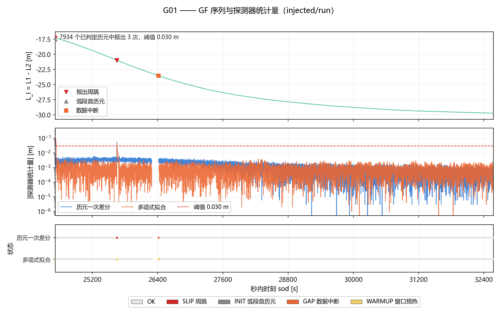

**图 7-2**　习题1 的探测器在 1 Hz 零基线注入运行上的表现（G01）。上：L_I 本身，
红三角为报出的周跳，灰三角为弧段首历元；中：一次差分的统计量（取绝对值）与
0.030 m 阈值，**纵轴对数**，并叠画 §四 的多项式残差以便对照；下：逐历元的判定状态。
这个弧从第 24517 秒才开始，首历元报 `INIT` 而非 `SLIP`——这正是上面五态编码
要解决的问题；随后注入的最小周跳 (1,1) 被检出，是阈值取
0.030 m = 0.56 × 0.0539 m 的直接结果（注入实验见 §五）。

---

## 四、习题3：基于多项式拟合的 GF 组合

### 拟合对象是重心化的序列

**不能直接对 `L_I` 拟合。** `L_I` 含 `λ1N1 - λ2N2`，量级 10⁵ m，用二次多项式去
分辨 5 cm 是 5×10⁻⁷ 的相对扰动，病态且残差检验失去意义。

拟合 `S(i) = L_I(i) - L_I(anchor)`：`S` 从 0 起、窗口内 O(1 m)，
常数项（模糊度和硬件延迟）被多项式的 a₀ 精确吸收。

### 具体设置

- 二阶多项式，基函数用**移位 Chebyshev** `{1, u, 2u²−1}`，`u ∈ [−1,1]`。
  用幂基 `{1, t, t²}` 且 `t` 以秒计时（15 分钟窗口 ≈ 900 s）法方程条件数可达 1e8，
  Chebyshev 基近正交，3×3 求解良态得多。
- 滑动窗口，长度 30 历元（1 Hz）/ 20（30 s），判定至少需要 8 个样本。
- **拟合窗口严格排除当前历元**（样本外预报），用残差 `L_I(i) - Ŝ(i)` 判定，
  阈值 `max(4·σ_res·√(1+h), 0.030)`，`h` 是预报点的杠杆值。
- 检出后立即重置窗口。
- 单步稳健重拟合：窗口内若有一个残差 `>3.5σ` 且 `>0.10 m` 的点，剔除后重拟合一次。
  **只做一步、不迭代到收敛**——完整的 IRLS 会把真实的阶跃逐步吸收进多项式，
  反而把周跳抹平。

### 滑入窗口的周跳会怎样

被检出的周跳因窗口重置而完全不污染拟合。真正的风险是**漏检**的周跳留在窗口里：
对 N=30 的 Chebyshev 拟合，某点的杠杆值在窗口中部为 0.093、边缘为 0.186，
一个 5.4 cm 的阶跃对后续预报的偏置上界约 `0.19×5.4 = 1.0 cm`，
低于阈值且不级联。设计上接受这个量级。

### 检测效果

图 7-3 取 G24，理由与上一节相反：它是 30 s 样例上一次差分报得最凶的一颗，
26 个已判定历元无一幸免（图 7-5），多项式拟合的收益在这颗星上最尖锐。
与 图 7-2 是同一套三面板，可以直接对照读。

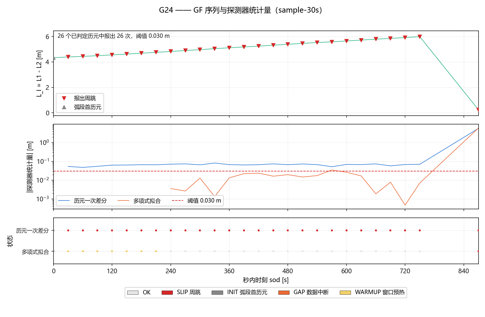

**图 7-3**　习题3 的多项式拟合在 30 s 样例上的表现（G24），与 §三 的一次差分对照。
注意中图：**一次差分的统计量全程压在阈值之上**（26 个已判定历元报了 26 次），
而多项式残差始终在阈值之下——这就是低采样率下必须改用多项式拟合的直接理由
（两条曲线的全面对比见 §六）。两条统计量共用一条阈值线是刻意的：
它们本来就是同一量纲、与同一个数比较，分开画会把这条线画两遍。

---

## 五、习题2：注入已知周跳的验证

### 方法

`scripts/inject_cycle_slips.py` 在 RINEX 文件的相位字段上加**整数周**，
写出真值清单。要点：

- 数据记录里相位单位是**周**，C++ 读取时才乘波长换算成米，所以加整数周即整周周跳。
- **同一频点的所有相位观测码一起改**。C++ 侧 `convertObsType` 按前两位折叠类型，
  且观测值存放在 `std::map` 里按字典序迭代，同频点多个码**后者覆盖前者**。
  样例数据 GPS 有 `L1C/L1W/L1X`，只改 `L1C` 的话探测器根本看不见。
- 实测：98 MB 的零基线文件注入 9 处后，**只有 9 行不同**，其余逐字节不变。

### 1 Hz 零基线结果（GPS+BDS，25 颗卫星，每颗至多 7936 历元）

在未注入的原始数据上，两种探测器的输出分布：

| | OK | SLIP | INIT | GAP | WARMUP | 已判定历元 | 检出比例 |
|---|---|---|---|---|---|---|---|
| diff | 117174 | 2182 | 25 | 29 | 0 | 119356 | 1.83% |
| poly | 114873 | 517 | 25 | 29 | 3966 | 115390 | 0.45% |

每行都满足 **已判定历元 = OK + SLIP = nTested**（`INIT` / `GAP` / `WARMUP`
不计入判定）——以后数字漂了，这一条能一眼看出来。`diff` 的 WARMUP 恒为 0：
一次差分没有预热窗口，`WARMUP` 是多项式拟合独有的状态。

这 2182 / 517 次**不是虚警**——零基线数据的载波相位确实频繁失锁。
原始相位的直接统计（C01，4390 个已判定历元）：连续历元 |ΔL_I| 中位数 0.0044 m，
但 90% 分位已到 0.7485 m，99% 分位 2.4881 m；跳变量集中在
0.248 m ≈ λ(B2I) 的整数倍上（如 0.7446 = 3×0.2483），是**真实的整周跳变**。

更直接的旁证：**G01 / G07 / G21 / G30 四颗星在 7934 个已判定历元里恰好 0 次**
（G17 同样 0 次，但它只跟踪到 6893 个历元）。
跟踪正常的信号上探测器一次都没报——这说明它不是在乱报。
报得多的 G16(28.7%) / C02(51.8%) / C01(17.7%) 是跟踪质量差、真实周跳密集的卫星，
逐卫星分布见 §六 图 7-5。

### 30 s 样例数据结果（63 历元，19 颗卫星）

| | OK | SLIP | INIT | GAP | WARMUP | 已判定历元 | 检出比例 |
|---|---|---|---|---|---|---|---|
| diff | 995 | 54 | 19 | 0 | 0 | 1049 | **5.15%** |
| poly | 907 | 2 | 19 | 0 | 140 | 909 | **0.22%** |

用**无电离层的 MW 组合**做交叉验证：MW 在同样数据上标记 21 个历元，
与 GF 一次差分标记的 54 个历元**只有 2 个重合**。也就是说 GF-diff 报出的
52 次在无电离层组合里看不到对应跳变，来源是电离层而非周跳。
这 54 次的 |ΔL_I| 中位数 0.0718 m，与 §二 里 30 s 电离层项的估算完全吻合。
（MW 自身的完整结果见 §六，这个重合度的图见 §七 图 7-9。）

### 注入验证：逐用例判定

GF 的两个探测器在 1 Hz 零基线注入运行上的判定：

| 用例 | (ΔN1, ΔN2) | 期望 ΔL_I | diff | poly |
|---|---|---|---|---|
| arc-start（首历元） | (5, 5) | −0.2696 m | INIT ✓ | INIT ✓ |
| **min-cycle-pair** | **(1, 1)** | **−0.0539 m** | **检出** | **检出** |
| **gf-null-space** | **(77, 60)** | **0.0000 m** | **漏检（预期）** | **漏检（预期）** |
| single-L1 | (1, 0) | +0.1903 m | 检出 | 检出 |
| single-L2 | (0, 1) | −0.2442 m | 检出 | 检出 |
| large-pair | (10, 10) | −0.5392 m | 检出 | 检出 |
| opposed-a | (6, 6) | −0.3235 m | 检出 | 检出 |
| opposed-b | (−6, −6) | +0.3235 m | 检出 | **WARMUP 漏检** |
| negative-pair | (−4, −4) | +0.2157 m | 检出 | 检出 |
| | | **检出率** | **7/8 = 87.5%** | **6/8 = 75%** |

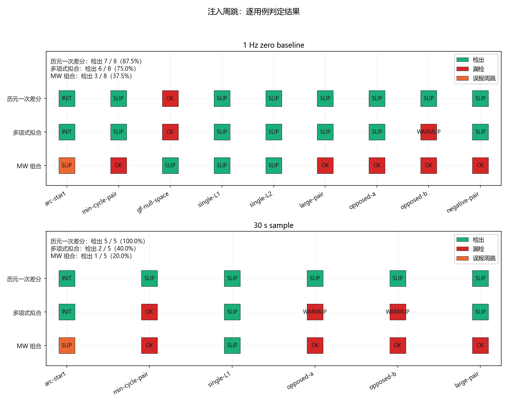

**图 7-4**　注入用例的逐条判定，每个探测器一行。上：1 Hz 零基线；下：30 s 样例。
绿 = 检出，红 = 漏检，橙 = 本该拒判却报了周跳。
`gf-null-space` 一列两个 GF 探测器全红，那是 GF 组合的数学盲区，**必须漏**；
MW 那一行正好相反——它是该列唯一的绿色，而 `min-cycle-pair`、`large-pair`、
`opposed-a/b`、`negative-pair` 这五列全红，因为它们都满足 `ΔN₁ = ΔN₂`（§七 会给这一条
单独出图）。橙色那格是 MW 的另一处性质：它的 `flag` 不区分弧段首历元与数据中断，
一律报成周跳（§六）。30 s 上 poly 的漏检则来自重置后窗口来不及预热。

三点结论：

1. **最小周跳 (1,1) 两种算法都检出了**，说明 0.030 m 的阈值选对了。
   若按教材把阈值设在 5.4 cm，这一例大约只有一半概率能被抓到。
2. **零空间 (77,60) 两种算法都漏检**，且必须漏检——这是 GF 组合的数学盲区，
   想覆盖它必须引入独立的第二组合（MW 对 `(77,60)` 给出 `ΔN_W = 17`，能抓住）。
   一个"什么都检得出"的实现反而是错的。
3. **首历元一律报 INIT 而非 SLIP**，这是与 MW 示例程序的重要差别。
   注意其代价：首历元的周跳本身不可探测，而且它会让**下一个历元**出现一次
   真实存在的差分，从而被报为周跳——这是原理限制，不是实现缺陷。

30 s 样例（63 历元）上，diff **5/5 全部检出**，poly 2/5（漏掉最小周跳与 opposed 对，
原因是重置后窗口只剩不到 8 个样本，都停在 WARMUP）。

把 MW 接进同一条评分链路（`check_cycle_slips.py --mode mw`）后，
第三个探测器的逐用例判定（图 7-4 的第三行就是这张表的图形版）：

| 用例 | (dN1, dN2) | ΔN_W | 1 Hz | 30 s |
|---|---|---|---|---|
| arc-start | 5, 5 | 0 | 误报（应为 INIT） | 误报（应为 INIT） |
| min-cycle-pair | 1, 1 | 0 | **漏检** | **漏检** |
| gf-null-space | 77, 60 | **+17** | **检出** | 未注入 |
| single-L1 | 1, 0 | +1 | 检出 | 检出 |
| single-L2 | 0, 1 | −1 | 检出 | 未注入 |
| large-pair | 10, 10 | 0 | **漏检** | **漏检** |
| opposed-a | 6, 6 | 0 | **漏检** | **漏检** |
| opposed-b | −6, −6 | 0 | **漏检** | **漏检** |
| negative-pair | −4, −4 | 0 | **漏检** | 未注入 |

检出率：1 Hz **3/8 = 37.5%**，30 s **1/5 = 20%**。

这张表与上面 GF 那张正好互补：**MW 检出了 GF 唯一漏掉的那一条（`gf-null-space`），
而 GF 检出的每一条 `ΔN₁ = ΔN₂` 用例它都漏了**。请注意 `arc-start` 一行——
MW 把首历元报成周跳，是它 `flag` 不区分状态的结果（§七 图 7-9 会再次暴露这一点），
而不是它比 GF 灵敏。

---

## 六、探测器性能对比：一次差分、多项式拟合与 MW 组合

| | 1 Hz 零基线 | 30 s 样例 |
|---|---|---|
| diff 检出率（注入） | **87.5%** | 100% |
| diff 非注入检出比例 | 1.83% | **5.15%** |
| poly 检出率（注入） | 75% | 40% |
| poly 非注入检出比例 | **0.45%** | **0.22%** |
| poly 停在 WARMUP 的比例 | 3.3% | 13.1% |

（WARMUP 比例按占总历元行数的份额计。）

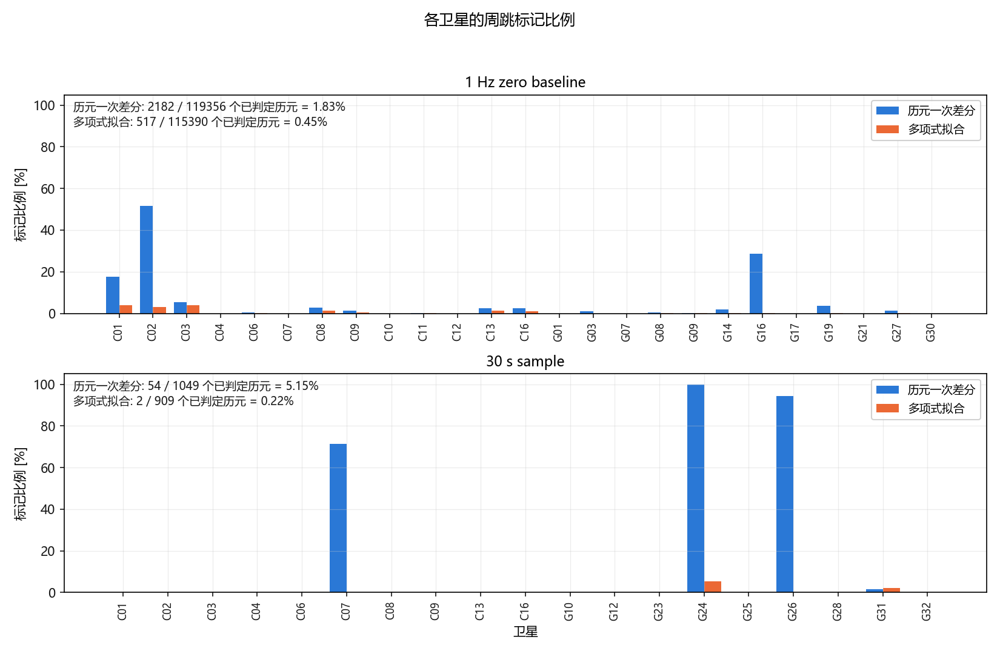

**图 7-5**　各卫星的标记比例，diff 与 poly 并列；上为 1 Hz 零基线，下为 30 s 样例。
纵轴刻意用 0–100% 线性而非对数：0.22% 与 5.15% 相差 23 倍，对数轴会把它们画成
相近的高度。小量级由左上角的注释文字承担。两栏的卫星集合不同，所以横轴不共享。
1 Hz 上的 C02(51.8%) / G16(28.7%) 与 30 s 上的 G24(100%) 都是跟踪质量差、
真实周跳密集的卫星，不是虚警。

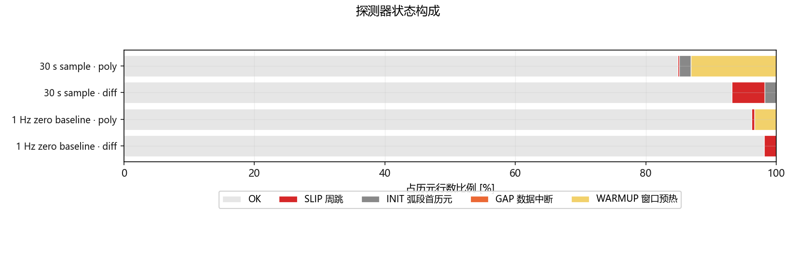

**图 7-6**　五态构成。比例按占总历元行数的份额计（与上表口径一致）。
WARMUP 的份额随历元间隔增大而膨胀（1 Hz 的 poly 为 3.3%，30 s 为 13.1%），
而 `diff` 一栏恒无 WARMUP——这是多项式拟合在低采样率下的固有代价。

### MW 组合的检出表现

| 数据 | 历元行数 | MW 标记 | 标记比例 |
|---|---|---|---|
| 1 Hz 零基线 | 119410 | 1736 | 1.45% |
| 30 s 样例 | 1068 | 21 | 1.97% |

对照上表：同为 30 s 数据，GF 一次差分标记 54 次（5.15%）、多项式 2 次（0.22%）。

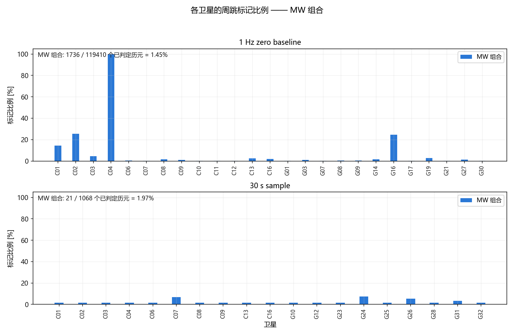

**图 7-7**　MW 的逐星标记比例，与 图 7-5 同口径（占总历元行数）。1 Hz 上 C04 接近 100%，
C02 与 G16 约 25%，其余卫星几乎为零。C04 是真实周跳密集的卫星（§五 已确认），不是虚警。

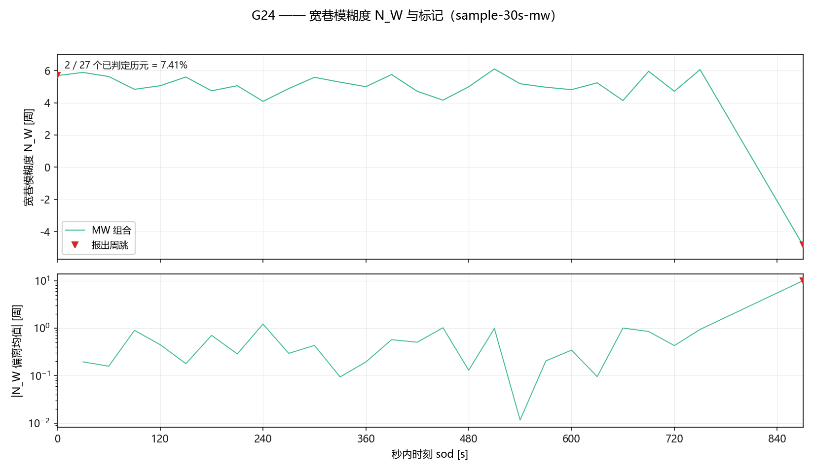

**图 7-8**　G24 在 30 s 样例上的 MW 组合。上：组合值本身，红三角为 MW 报出的历元。
下：探测器**实际比较的量**——当前历元的组合值，减去它**上一个历元结束时**的递推均值。
（文件里存的 `meanMW_m` 是**更新之后**的均值，而探测器一旦报出周跳就把均值重置成当前值，
所以拿同一历元直接相减会恒等于零；错一位取差还原出来的才是判据用的量。）
与 图 7-3 是同一颗卫星，可直接对照：**一次差分在 G24 上把每个历元都报了，MW 只报 2 个。**

这里只有两张面板而不是 图 7-2 的三张：MW 不输出残差列，下图那条曲线是从文件里还原的。
GF 图上的阈值线这里也没有画，而 MW 其实有**两个**阈值——一个是固定的
`minCycles(2.0) × wavelengthMW`，在本文用的周制下正好是 **2.0 周**，画成一条横线即可；
另一个是自适应的 `4√varMW`，它需要 C++ 多写一列，见 `docs/roadmap.md` 的已知问题。

### 三者的权衡

三者是清晰的权衡，不是谁全面更好：

- **采样率高时用一次差分。** 1 Hz 下电离层每历元只变化不到 1 mm，
  (7.9) 的前提成立；一次差分没有任何预热，周跳后立刻恢复判定能力，
  所以它能接住 opposed 这种相邻两历元的用例，检出率反而更高。
- **采样率低时必须用多项式拟合。** 30 s 下电离层每历元变化 10–30 mm，
  与 5.4 cm 的最小周跳同量级，一次差分根本分不清电离层漂移和周跳，
  实测 5.15% 的历元被标记。二次多项式把平滑的电离层吸收进模型，
  非注入检出降到 0.22%，比一次差分干净 23 倍。
- **多项式拟合的代价是预热。** 每次重置后要重新累积 8 个样本，
  数据越短、周跳越密，越多历元停在 WARMUP。30 s 样例只有 63 个历元，
  这个代价直接压低了检出率（40%）。周跳密集的弧段上它是自限制的。
- **MW 与两者都不同源。** 它对电离层不敏感（§二），所以在 30 s 上不被电离层骗到；
  但它只能看见 `ΔN₁ ≠ ΔN₂` 方向，1 Hz 的检出率（37.5%）低于 GF 的两个探测器。

**实践建议：** 先看数据本身的 |ΔL_I| 中位数与历元间隔。若相邻历元
`(γ-1)·ΔI` 远小于 5.4 cm，用一次差分；否则用多项式拟合，并接受它的预热代价。
MW 无论如何都值得并行跑——它补的是另外半边，理由见 §七。

---

## 七、交叉验证与盲区互补

§六 把三者放在一起比了检出率，但漏检的位置比数量更重要。本节用两组结果
把 §二 那张"两个盲区互为补集"的表变成实测。

### 交叉验证：重合的多寡就是结论

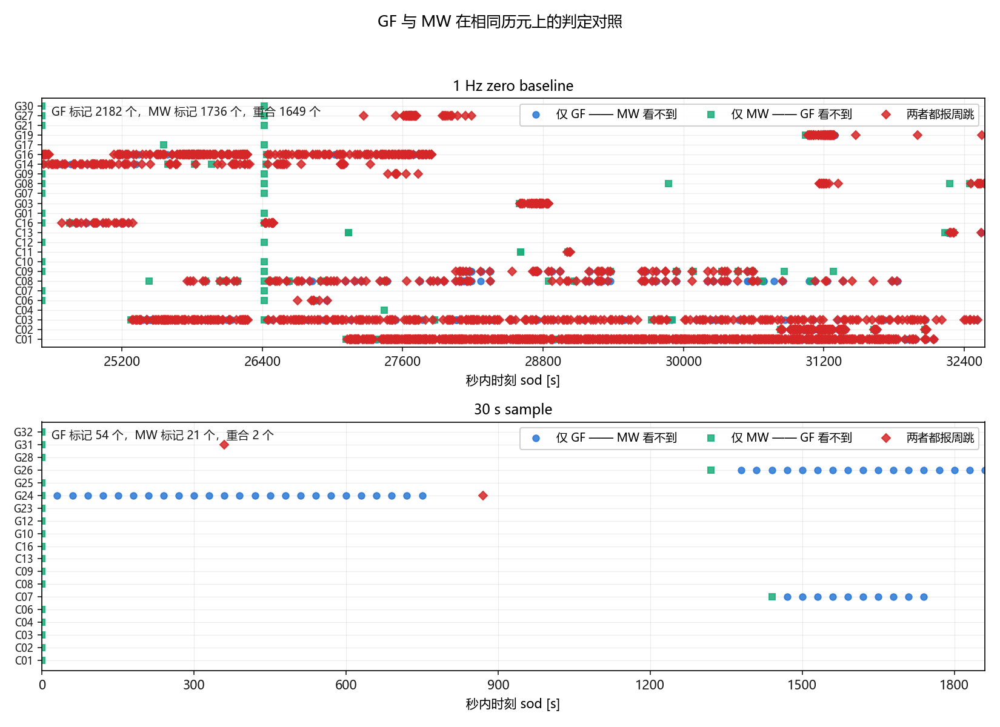

**图 7-9**　同一份数据上 GF 一次差分与 MW 各自报出的历元，逐卫星按时间铺开。

| 数据 | GF-diff 标记 | MW 标记 | 两者重合 |
|---|---|---|---|
| 1 Hz 零基线 | 2182 | 1736 | **1649**（占 MW 的 95%） |
| 30 s 样例 | 54 | 21 | **2**（占 MW 的 10%） |

**1 Hz 上两者高度一致，30 s 上几乎不重合**，这正是 §五 那个结论的图形版：1 Hz 上电离层
每历元不到 1 mm，GF 报出的基本是真周跳，MW 也看得见；30 s 上 GF 那 54 次里有 52 次是
电离层（§五 用 |ΔL_I| 中位数 0.0718 m 论证过），MW 看不见它们，**因为它对电离层不敏感**。
重合度低不是 MW 失效，是它没被电离层骗到。

图 7-9 下栏还暴露了 MW 的一个缺点：sod ≈ 26400 处有一条贯穿几乎所有卫星的绿线，
那是数据中断后的首个历元，MW 把它们一律报成周跳。**MW 的 `flag` 不区分"弧段首历元 /
中断后首历元 / 真周跳"**——`apps/cs_detect_mw.cpp` 的文件头自己写明了这一点，
也正是 GF 探测器改用五态编码要解决的问题（§三"弧段首历元与数据中断不做判定"）。

### 两个零空间的实证

两个组合各自的盲区，各用一次注入把它钉死，而且用同一套画法——角色对调而已。

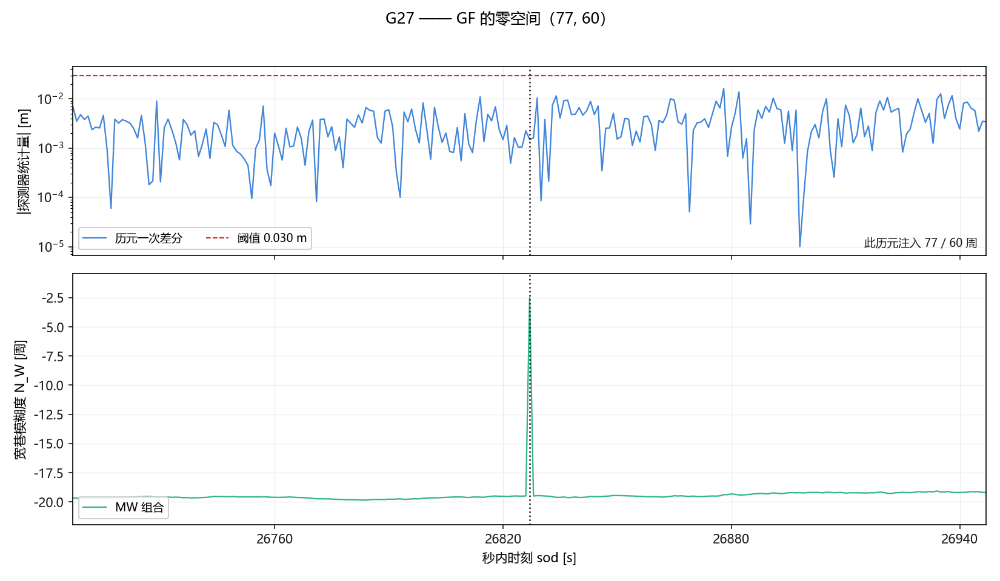

**图 7-10**　`(77, 60)` 注入在 G27、sod 26827 上的效果。上图：GF 一次差分的统计量在整个
窗口内都低于 0.030 m 阈值，在注入时刻（虚线）**毫无反应**；下图：MW 组合在同一历元跳了
17 周（正是注入的 ΔN_W = 17）。这不是阈值调得不合适——`77λ₁ − 60λ₂ = 0`，
GF 组合在那一历元**根本没有变化**，任何阈值都取不出来。

把它翻过来，就是 MW 盲的那一半：

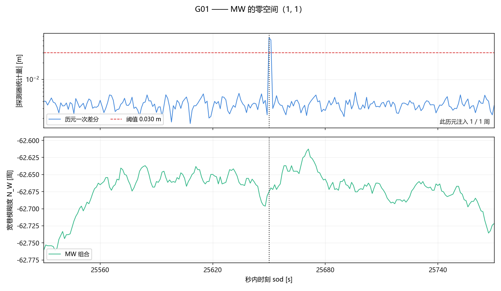

**图 7-11**　`(1, 1)` 注入在 G01、sod 25650 上，与图 7-10 严格对称。
上图：GF 一次差分的统计量在注入历元跳到 0.056 m，**冲过 0.030 m 阈值线**（红虚线），
可靠检出；下图：MW 组合在同一历元只变了 **0.006 周**，没有任何阶跃。
下面这幅的纵轴是自适应的，这一点值得点破：**整幅窗口全加起来也只变化 0.15 周**，
比 GF 一次差分的单历元噪声还小。原因与 GF 的盲区完全对称——MW 的统计量是 `N₁ − N₂`，
`(1, 1)` 在它里面**恰好抵消**，正如 `77λ₁ − 60λ₂ = 0` 让 GF 无反应。

至此 §二 的两行盲区表全部由断言变成实测，而且**两个方向各有一张图**：
GF 漏 `(77, 60)`，MW 漏 `(1, 1)`、`(10, 10)`、`(±6, ±6)`、`(−4, −4)`。

### 两个盲区互为补集

§二 那张盲区表的两行，到这里都已经由断言变成实测，而且是被一对镜像图钉死的：
GF 漏掉 `(77, 60)`（图 7-10，GF 平、MW 跳 17 周），MW 漏掉全部 `ΔN₁ = ΔN₂` 用例
（图 7-11 画了其中一条，§五 的表给出余下四条）。**谁也无法单独覆盖
全部周跳，必须并行跑、取并集。**

这也修正了"MW 更全面"的直觉：30 s 数据上它的检出率（20%）反而远低于
GF 一次差分（100%）——两个组合不是强弱关系，是**盲在不同的地方**。

并集的代价是虚警也取并集：30 s 上 MW 的非注入标记 20 次（1.87%），
GF 一次差分 54 次（5.15%）。

---

## 八、已知局限

1. **GF 对 `(77k, 60k)` 完全盲。** 实测见 §七：MW 能检出这一条用例，但它自己盲在
   `(k, k)` 上，两者只能取并集，谁也不是完备的。
2. **只探测、不修复。** 没有把周跳恢复到模糊度里去，`docs/roadmap.md` 已有声明。
3. **窗口状态是函数内 `static`。** 照教材 7.2 节"设计为函数需设为 static 变量"
   的做法，代价是同一进程内无法重置——连读两个文件时状态会串。
   一次性命令行程序不受影响，但要做回归测试就得先把这份状态从函数里挪出来。
4. **单频点。** `deltaTMax` 默认 120 s，教材建议 30 min；两者都只是经验值，
   本实现选了更严格的一侧。
5. **`varOfGF` 用固定的 3 mm 载波噪声**，未按高度角加权。低仰角上真实噪声更大，
   会同时抬高虚警和漏检。

---

## 九、复现方法

```bash
scripts/build.sh

# 1 Hz 零基线（未入库，需自备 data/Zero-baseline/）
./build/bin/cs_detect_gf.exe --obs data/Zero-baseline/oem719-202203031500-1.obs \
                             --out-dir output/cs/zero-1hz --mode both

# 30 s 样例（已入库）
./build/bin/cs_detect_gf.exe --obs data/sample/WUH200CHN_R_20250010000_01D_30S_MO.rnx \
                             --out-dir output/cs/sample-30s --mode both --window 20

# 习题2（1 Hz）：注入 -> 探测 -> 评分
# 图 7-2 与 §五 第一张表都出自这一条链路
python scripts/inject_cycle_slips.py --obs data/Zero-baseline/oem719-202203031500-1.obs \
                                     --out output/cs/injected/oem719-injected.obs
./build/bin/cs_detect_gf.exe --obs output/cs/injected/oem719-injected.obs \
                             --out-dir output/cs/injected/run --mode both
python scripts/check_cycle_slips.py --manifest output/cs/injected/oem719-injected.obs.slips.csv \
                                    --run output/cs/injected/run --mode diff \
                                    --baseline output/cs/zero-1hz

# 习题2（30 s）：同上，换成样例数据与 --window 20
python scripts/inject_cycle_slips.py --obs data/sample/WUH200CHN_R_20250010000_01D_30S_MO.rnx \
                                     --out output/cs/injected/wuh2-injected.rnx --plan sample
./build/bin/cs_detect_gf.exe --obs output/cs/injected/wuh2-injected.rnx \
                             --out-dir output/cs/injected/run-30s --mode both --window 20
python scripts/check_cycle_slips.py --manifest output/cs/injected/wuh2-injected.rnx.slips.csv \
                                    --run output/cs/injected/run-30s --mode diff \
                                    --baseline output/cs/sample-30s

# MW 组合（§六、§七）：同样这四个数据集，读的是同一个 config/cs.ini
./build/bin/cs_detect_mw.exe --obs data/Zero-baseline/oem719-202203031500-1.obs \
                             --out-dir output/cs/zero-1hz-mw
./build/bin/cs_detect_mw.exe --obs data/sample/WUH200CHN_R_20250010000_01D_30S_MO.rnx \
                             --out-dir output/cs/sample-30s-mw
./build/bin/cs_detect_mw.exe --obs output/cs/injected/oem719-injected.obs \
                             --out-dir output/cs/injected/run-mw
./build/bin/cs_detect_mw.exe --obs output/cs/injected/wuh2-injected.rnx \
                             --out-dir output/cs/injected/run-30s-mw

# §五 里 MW 的逐用例判定表（--mode mw）
python scripts/check_cycle_slips.py --manifest output/cs/injected/oem719-injected.obs.slips.csv \
                                    --run output/cs/injected/run-mw --mode mw \
                                    --baseline output/cs/zero-1hz-mw
python scripts/check_cycle_slips.py --manifest output/cs/injected/wuh2-injected.rnx.slips.csv \
                                    --run output/cs/injected/run-30s-mw --mode mw \
                                    --baseline output/cs/sample-30s-mw

# 出图（本文 11 张图，写入 docs/figures/）
PYTHONPATH=python/src python -m gnss_plot.cli cs-plot --lang zh --docs-figures
```

输出格式见 `apps/cs_detect_gf.cpp` 与 `apps/cs_detect_mw.cpp` 的头部注释；
注入工具是确定性的，同样输入必得同样的注入文件与真值清单。

`gnss cs-plot` 只读上面这些已经跑出来的输出，自己不跑探测器；
它按 `<cs-dir>/zero-1hz`、`sample-30s`、`injected/run` … 这套约定去找，
MW 的四个运行则是同一套名字加 `-mw`（`zero-1hz-mw`、`injected/run-30s-mw` …），
缺哪个就跳过哪个并打一句 warning，全都没有才报错。

注意 **1 Hz 零基线未入库**，所以干净克隆上重不出来——1 Hz 的数据只体现在
图 7-1、图 7-2、图 7-7 上栏、图 7-9 上栏与图 7-10、图 7-11 里，这些 PNG 是它的
行为在仓库中的唯一留存；30 s 那部分（含 MW）在干净克隆上可以完整复现。
