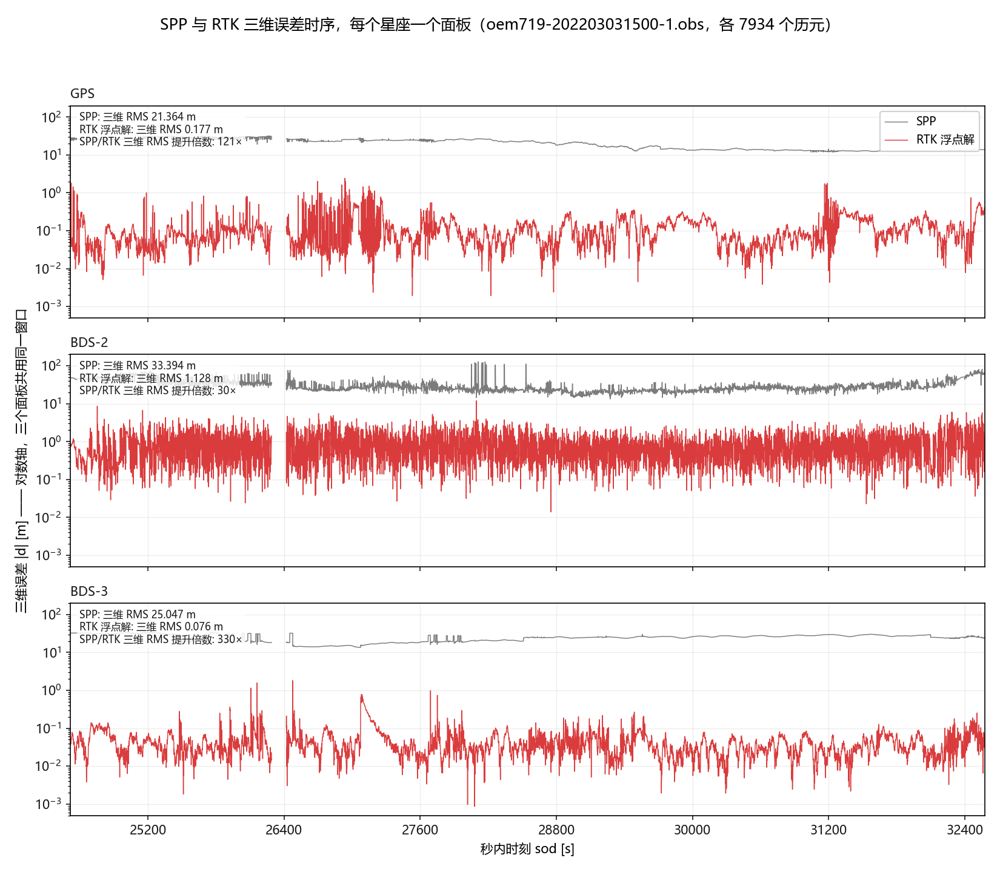
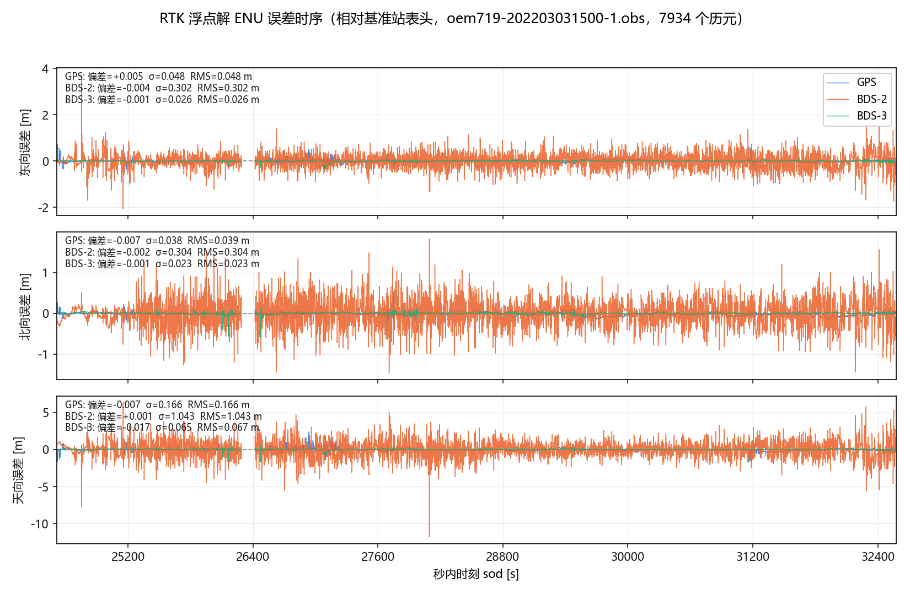
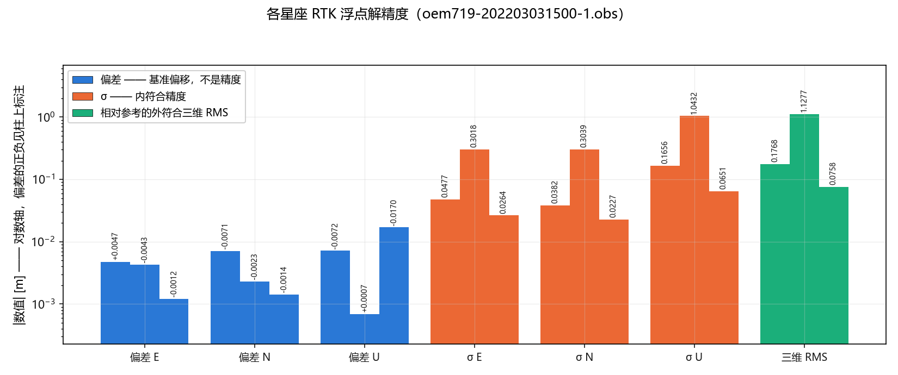
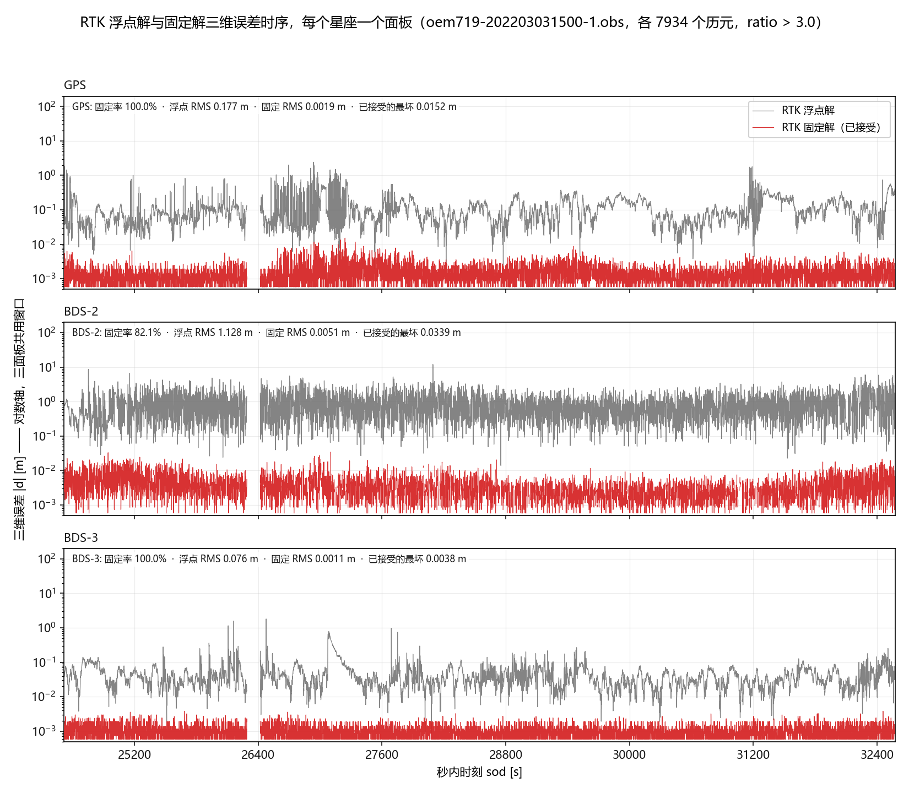
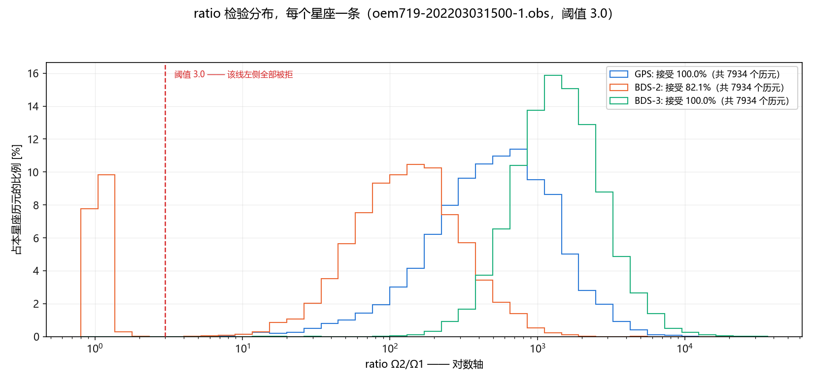

# 第8章 RTK：单历元最小二乘浮点解与 GPS/北斗精度对比

本章（教材 8.1–8.5，习题 1、2）对应的程序是 `apps/rtk`，示例程序是
`examples/sync_obs`、`examples/diff_station` 与 `examples/exam-8.3-lambda.cpp`
（目标 `mlambda`）。本文记录六件事：**做这道题时踩到的两个读取器 bug**（第二节）、
**浮点解在数学上不可能用上载波相位**（第三节）、
**GPS、北斗二号、北斗三号三种配置的实测精度对比**（第四节）、
**模糊度固定带来的两个数量级**（第八节）、
**北斗两代混解与那个"接收机系统差"到底有多大**（第九节），以及
**卡尔曼滤波把浮点解又提高了 4–11 倍**（第十节）。第四节的结果里，
北斗二号与北斗三号差了一个数量级，原因在第五节。

图见 `figures/vis_rtk_spp_vs_rtk_ts.png`（SPP 与 RTK 的三维误差时序，图 8-1）、
`figures/vis_rtk_error_enu_ts.png`（ENU 三轴误差时序，图 8-2）、
`figures/vis_rtk_accuracy_bars.png`（精度对比柱状图，图 8-3）、
`figures/vis_rtk_float_vs_fixed_ts.png`（浮点解与固定解三维误差时序，图 8-4）与
`figures/vis_rtk_ratio_hist.png`（ratio 检验分布，图 8-5），
后两张需要求解器带 `--fix` 跑过，均由 `gnss rtk-plot` 生成。

---

## 一、程序做了什么

`apps/rtk` 每个历元独立解一次，流程与教材 8.4 节的主程序伪代码一致：

1. 读流动站一个历元，用 `SPPUCCodePhase::solve` 做非差非组合伪距+载波单点定位；
2. 读时间匹配的基准站历元（用 `RinexObsReader::parseRinexObs(CommonTime&)` 同步），
   同样做单点定位；基准站位置已知，所以只线性化、不迭代；
3. `differenceStation()` 求站间单差；
4. 选基准星，`differenceSat()` 求星间单差（即双差）；
5. `SolverLSQ` 解双差方程组，得到坐标增量，加到流动站单点解上输出。

默认没有模糊度固定，也没有跨历元约束——这正是「单历元最小二乘浮点解」的字面含义。
两个开关各自加一层：`--fix` 在第 5 步之后接上教材 8.3.5 的模糊度固定与坐标回代
（第八节）；`--estimator kalman` 把求解器换成教材 8.3.4 的卡尔曼滤波，模糊度跨历元
传递（第十节）——**只有这一条才有跨历元约束**。

四个可选的星座/频点配置（`--sys`，或 `config/rtk.ini` 的 `sys` 键）：

| `sys` | 星座 | 频点 | RINEX 类型 | 频率 |
|---|---|---|---|---|
| `gps` | GPS | L1/L2 | `C1C` + `C2W` | 1575.420 / 1227.600 MHz |
| `bds2` | 北斗二号 | B1I/B2I | `C2I` + `C7I` | 1561.098 / 1207.140 MHz |
| `bds3` | 北斗三号 | B1I/B2a | `C2I` + `C5P` | 1561.098 / 1176.450 MHz |
| `bds23` | 北斗二号+三号 | 按卫星取第二频点 | `C2I` +（`C7I` 或 `C5P`） | 见第五节 |

一次只能解一个**星座**：双差需要一个唯一的基准星，而跨星座（GPS+北斗）就得
每个星座各配一颗基准星，那是另一件事（第十一节已知局限）。北斗的**两代**可以合在
一个解里（`bds23`）——它们同属一个星座、共享一颗基准星，但第二频点不同，
所以要**按卫星**选频点；跨代的系统差见第九节。

### 输出

| 文件 | 内容 |
|---|---|
| `<流动站>_<sys>_rtk_float.out` | 每历元一行，教材格式：`YDSTime spp: X Y Z rtk: X Y Z` |
| `<流动站>_<sys>_rtk_fixed.out` | 仅 `--fix`：教材主程序的格式 `spp: … float-rtk: … ratio:R fixed-rtk: …`。**被拒历元上写的是浮点解**，用前必须按 `ratio` 过滤 |
| `<流动站>_<sys>_rtk_diag.csv` | 每历元的秩、条件数、基准星、验后残差，以及 `nAmb` / `ratio` / `fixed` / `absDxyzFixed` / `isb` |
| `<流动站>_<sys>_manifest.json` | 本次运行的设置与跳过历元的分类计数（`--fix` 时另含阈值与固定历元数） |

固定解写在**单独的文件**里，而不是给浮点解那个文件加列：后者的每一行都与原版
gnssLab-2.2 程序的输出**逐字节相同**，是本章唯一的外部锚点
（`tests/test_rtk_float_regression.py`，第七节）。

---

## 二、两个读取器 bug：载波相位从来没有进过模型

做这一章之前，仓库里的 `RinexObsReader` 有两个从上游继承下来、一直没被发现的缺陷。
两个都不是重构引入的（`git log -S` 确认本仓库只搬过目录），而且**任何现有程序都
碰不到**，所以一直潜伏着。

### 2.1 载波相位被写进了多普勒表

`RinexObsReader.cpp` 里处理 `L*` 观测的分支原本是：

```cpp
if (obsType[0] == 'L') {
    ...
    data = -data / lambda;        // 符号反了，而且量纲是「周/米」
    if (fabs(data) < 1e-4) continue;
    dopplerMap[obsType] = data;   // 相位进了多普勒表
}
```

三处错：**符号反了**、**除以波长是错的量纲**（RINEX 的 `L*` 是周，乘波长才是米）、
以及**写进了 `dopplerMap`**。而 `satTypeValueData` 只由 `rangeMap` 组装，所以
**载波相位从来没进入过观测数据**——它对所有消费者都是不可见的。

实测确认（`data/Zero-baseline`，历元 1，G01）：

```
L1C = 116697983.8241 周  ×  λ₁ = 0.190293673 m  =  22 206 887 m
C1C =                                        22 206 873.798 m
```

差 13 m，正是模糊度。所以正确写法是 `data * lambda`，符号为正。

**为什么一直没暴露**：`spp_if` 走的是双频消电离层**伪距**组合，只认 `CC12`/`CC27`，
逐类型显式过滤；测速解算只按 `"D1"`/`"D2"` 前缀取多普勒；第 7 章的探测器走的是
`GnssFunc.cpp` 里**另一条**读取路径（自由函数 `parseRinexObs`），根本不经过这个类。

### 2.2 续行被当成新系统，第 13 个以后的观测类型全丢

同一个文件里 `SYS / # / OBS TYPES` 的处理：

```cpp
string sysStr = line.substr(0, 1);
strip(sysStr);                       // strip 按值传参并返回新串，返回值被丢弃
if (!sysStr.empty()) { ... }         // 续行首字符是空格，这里却进了真分支
```

RINEX 一个系统声明超过 13 个观测类型时，第 14 个起写在**续行**上。续行首字符是空格，
但 `strip` 的返回值被丢掉，`sysStr` 仍是 `" "`（非空），于是续行被当成新的系统块：
`satSys` 变成空格、数目从错误的列去读，**第 13 个以后的所有类型静默丢失**。

零基线数据里北斗声明 **20** 个类型，丢掉的是
`L7D D7D S7D C5P L5P D5P S5P`——其中 **`C5P`/`L5P` 就是 B2a**。
这一条直接决定了第五节里北斗三号能不能用。

### 2.3 两个修复都是安全的

`tests/test_regression_pipeline.py --required` 的断言是 `spp_if` 两个冻结输出文件
逐字节一致。两个修复之后**实测仍然逐字节一致**——这与上面「现有程序碰不到」的分析
吻合：IF 组合按显式码对过滤，测速按前缀过滤。

### 2.4 顺带清掉的无保护打印

`RinexObsReader` 逐卫星循环里漏下一行 `cout << endl;`（每个历元每颗星一个空行），
`.../SPPIFCode.cpp`、`SolverLSQ.cpp`、`SPPUCCodePhase.cpp` 各有一个硬编码的
`#define debug 1`，`GnssFunc.cpp` 有两处完全无法关闭的打印。都改成跟随既有的
`GNSSLAB_DEBUG_*` 开关（默认 0，用 `-DGNSSLAB_DEBUG_RTK=1` 之类按目标打开）。
同样只影响 stdout，两个基线文件不变。

> 未处理：`NavEphGPS::svClockBias` 每次调用打 3 行（`bds_eph` 的冒烟测试
> `tests/test_apps_config_smoke.py:247` 有意断言它恰好出现一次，用来防止一段
> 硬编码的假输出复活）。它属于第 9 章的程序，本轮不动。

---

## 三、浮点解用不上载波相位——这是数学必然而非实现缺陷

这是本章最值得写进报告的结论。

### 3.1 为什么

`SPPUCCodePhase::linearize` 为**每一条**相位方程各建一个独立的模糊度参数：
`Variable(station, sat, ambiguity, ObsID(system, "L1"))`。于是双差设计阵里，

- 坐标列：每条方程一行，每行是三个方向余弦之差；
- 模糊度列：**每个模糊度只出现在一条方程里**，构成一个对角块。

即设计阵形如 `[ C | Λ ]`，其中 `Λ` 是对角的。对**任意**坐标 δ，都能取

```
N_i = (prefit_i − c_i·δ) / λ_i
```

把每条相位方程的残差**精确消成零**。按分块求逆消去模糊度块，坐标的舒尔补是：

```
CᵀWC − CᵀWΛ(ΛᵀWΛ)⁻¹ΛᵀWC  =  CᵀWC − CᵀWC  =  0
```

**相位对坐标的信息量恰好为零。** 位置只由伪距双差决定。

### 3.2 实验验证

把修复前后的输出直接对比：

| 配置 | 输出文件 |
|---|---|
| 修复前（相位进不了模型） | 2925 字节 |
| 修复后（相位进入模型：方程 16→32，未知数 12→28） | 2925 字节，**逐字节相同** |

也就是说，读不读得到载波相位，**浮点解一个字都不变**。单点解那一列同理。

### 3.3 所以这道题在比较什么

浮点解的精度**就是伪距双差的精度**。教材 8.3.3 把最小二乘分成三步
（(a) 浮点解 → (b) LAMBDA 固定 → (c) 回代修正），8.3.4 又专门讲卡尔曼滤波——
那两步才是让载波相位变现的地方：

- **滤波层**（8.3.4）：模糊度跨历元按常数模型传递，多历元才把相位与坐标解耦；
- **固定层**（8.3.5 / LAMBDA）：模糊度约束为整数后回代，
  `X = X̂ − Q_X̂N̂ Q_N̂⁻¹(N̂ − N)` 才是厘米级精度的来源。

本节的结果因此是**习题 1 的正确结论**，而不是「做得不够」：单历元、浮点、
无固定，本来就只有伪距精度。**固定层在习题 2 里做完（第八节），滤波层在第十节做完**
——而且第十节的实测正好印证了这一节：单历元浮点解的精度被伪距坐标锁住，而滤波器
是解开这把锁的东西，浮点解因此提高了 4–11 倍。

---

## 四、习题 1 的结果：三种配置的精度对比

数据：`data/Zero-baseline/`（两台 NovAtel OEM719、**共天线零基线**、2022-03-03、
1 Hz、约 2 小时）。基准站 RINEX 头文件坐标
`(-2267812.4743, 5009352.1093, 3221012.1444)` 作为参考位置。

**7934 个历元**（另有 2 个历元因基准站无匹配时刻被跳过）：

σ 列是**站心 ENU 坐标系**（E 东、N 北、U 天顶），由 `gnss_plot` 的
`coords.enu_position_error` 旋转得到；`_rtk_diag.csv` 与 `gnss rtk-plot` 同时会打出
ECEF 三轴的值，两者不可混用（见下方注记）。

| 配置 | SPP 3D-RMS | **RTK 3D-RMS** | RTK σ (E, N, U) | \|d\| 50 / 95 / max | SPP→RTK |
|---|---|---|---|---|---|
| GPS L1/L2 | 21.364 m | **0.177 m** | (0.048, 0.038, **0.166**) | 0.081 / 0.307 / 2.431 m | 121× |
| 北斗二号 B1I/B2I | 33.394 m | **1.128 m** | (0.302, 0.304, **1.043**) | 0.675 / 2.227 / 12.000 m | 30× |
| 北斗三号 B1I/B2a | 25.047 m | **0.076 m** | (0.026, 0.023, **0.065**) | 0.034 / 0.106 / 1.813 m | 330× |



**图 8-1**　SPP 与 RTK 的三维误差时序，每个星座一个面板（上起 GPS、北斗二号、北斗三号），
纵轴对数、三个面板共用同一窗口。灰线为 SPP，红线为 RTK 浮点解；面板左上角标注两者的
三维 RMS 与提升倍数。对数轴是必需的：两列相差 30–330 倍，线性轴上 RTK 会退化成贴着
零线的一条直线。三个面板共用窗口同样是为了可比——各自缩放会让北斗二号的 1.13 m 与
北斗三号的 0.076 m 看起来一样。

四条结论：

1. **RTK 相对 SPP 提升两个数量级**（30–330 倍）。这是零基线，共模误差几乎全消，
   所以这个倍数主要反映「相对定位」本身的价值，与星座关系不大。
2. **三种配置一律是垂直方向最差**：U 轴的 σ 都比水平两个方向大 2–4 倍
   （GPS 0.166 vs 0.048/0.038；北斗三号 0.065 vs 0.026/0.023）。
   这是卫星几何本身决定的——垂直方向没有可用的几何约束，三个配置都逃不掉。
3. **北斗三号在三个方向上都最好**：中位误差 3.4 cm，比 GPS 的 8.1 cm 好一倍多，
   水平 σ 只有 26 mm / 23 mm。
4. **北斗二号差一个数量级**：中位 0.675 m，最坏 12 m，U 轴 σ 达到 1.04 m。



**图 8-2**　三个星座的 E / N / U 误差时序，三个面板分别对应三个轴。
与图 8-1 对照读：图 8-1 里合成一条红线的 RTK 解，在这里被拆成东、北、天顶三个方向，
天顶那一条明显最宽——这就是结论 2 的图形依据。

> **ECEF 与 ENU 不要混用。** 本文初稿曾把 ECEF 三轴标准差标成 ENU，
> 于是「GPS 的 Y 轴 σ 最大（0.136）」被读成了「北向最差」，而旋转到站心之后
> 北向其实是 0.038、最差的是天顶 0.166——结论正好相反。
> ECEF 的 `dY` 混合了北向、东向和天顶三个分量，它在数值上偏大说明不了任何方向的问题。
> `gnss_plot.rtk` 因此把 ENU 作为标注的坐标框架，ECEF 值另列一行并明确标出。

### 关于「偏差」这一列：它不是精度指标

上表没有单列偏差，因为在这个实现里它**混了三样东西**：基准站头文件坐标本身的误差、
流动站单点解未完全收敛的残差、以及零基线两端头文件坐标的 7 cm 差异。
详见第七节。要报的话，ENU 三个方向的偏差分别是
GPS `(+0.005,-0.007,-0.007)`、北斗二号 `(-0.004,-0.002,+0.001)`、
北斗三号 `(-0.001,-0.001,-0.017)` 米——都接近零，但**零基线数据上的零偏差
不构成「这个模型没有系统差」的证据**。

**唯一不依赖参考坐标的指标是 SPP/RTK 的比值**：两列都对同一个基准站头文件取差，
基准偏差在比值里抵消，所以上表最右列才是无保留的结论。



**图 8-3**　上表七项量的柱状图版本，按星座分组、按偏差／σ／三维 RMS 三类上色；
纵轴取绝对值并对数，偏差的正负标在柱顶（原因见本节开头）。

### 零基线这个前提要说清楚

零基线（两台接收机接同一天线）意味着星历误差、电离层、对流层、多路径在站间差分里
几乎精确抵消。所以上表度量的是**双差之后剩下的伪距噪声与多路径差异**，
**不能直接推广**成「GPS RTK 和北斗 RTK 在一般基线上的精度」。要那个结论需要一套
几十公里基线的数据。

---

## 五、北斗频点的陷阱：B1I+B2I 只覆盖北斗二号

这一节是本轮最容易出错的地方，也是最初选错频点的地方。

### 5.1 两代北斗不播同一个第二频点

实测（`data/Zero-baseline`，历元 1 的原始 RINEX）：

| | B1I (`C2I`) | B2I (`C7I`) | B1C (`C1P`) | B2a (`C5P`) |
|---|---|---|---|---|
| 北斗二号 `C01`–`C16` | ✓ | ✓（GEO 除外） | ✗ | ✗ |
| 北斗三号 `C19`+ | ✓ | **✗** | ✓ | ✓ |

北斗二号播 B2I，**北斗三号不播**；北斗三号播 B2a，北斗二号不播。
所以 `B1I+B2I` 和 `B1I+B2a` **互不包含**，选前者会把整个北斗三号排除掉。

### 5.2 代价

两种配置在零基线上都得到 **6 颗**卫星，但构成完全不同：

- `bds2` → 6 颗**北斗二号**，以 IGSO 为主，全部挤在亚太上空，方位分布差；
- `bds3` → 6 颗**北斗三号**，全是 MEO，几何分布与 GPS 可比。

结果就是第四节里 1.128 m 与 0.076 m 的差距——**同样的解算代码、同样的 6 颗星、
差 15 倍**，差别只在几何构型与星历质量。

> **第九节回看这一节**：两代该分开跑，这一点结论没错，但理由不是"接收机钟差有
> 系统差"——实测那个差只有 −1.2 cm，即零。理由是**频点不兼容**：没有任何一对
> 频点能覆盖两代。见 9.4 第 2 条。

> 最初的判断错误在于：为了与第 7 章 `detectCSMW` 的北斗频点保持一致而选了 B1I+B2I，
> 但没有先查数据里两代北斗各播什么。**`detectCSMW` 用 L2/L7 是有历史原因的
> （它就是那么建的、也就那么验证的），不构成 RTK 也必须用同一对频点的理由。**
> 代码里 `app_utils.h` 的 `rtkModes()` 与 `cycleSlipObsTypes()` 现在是两张独立的表，
> 头文件注释写明了**不要合并**。

### 5.3 顺带说明：`C6I`（B3I）在这份数据里不存在

`apps/spp_if.cpp` 的北斗 IF 组合用的是 `C2`/`C6`（B1I/B3I）。但零基线数据的北斗
类型表里**没有 C6I**，所以在这份数据上 `spp_if` 的北斗一路是空转的。
这不是本轮引入的问题，也不影响 `spp_if` 的冻结基线（那份基线用的是 `data/sample/`
的另一套数据）——**但如果将来拿这份数据去验 `spp_if` 的北斗，会得到空结果。**

---

## 六、粗差诊断：验后残差是最有价值的一个数

仓库里原本**没有任何地方检查拟合好坏**——`SolverLSQ::solve` 算完状态向量就结束了。
好处是快，坏处是**一个坏历元和一个好历元从输出文件上看一模一样**。

`apps/rtk` 因此自己算两个量写进 `_rtk_diag.csv`：

```
sigma0  = sqrt( Σ wᵢvᵢ² / (nObs − nUnk) ),   v = H·x − prefit
```

用锚点窗口（25 历元）举例，两个已知的坏历元被干净地挑出来：

| sod | `rank`/`nUnk` | `cond` | `sigma0` |
|---|---|---|---|
| 24517–24523 | 15/15 | 27.95 | 0.045 – 0.071 |
| **24524** | 17/17 | 27.98 | **1.374** |
| 24525–24540 | 15/15 | 27.96 – 27.99 | 0.043 – 0.070 |
| **24541** | 17/17 | 28.01 | **1.103** |

其余历元的 σ₀ 在 0.04–0.07 之间，这两个历元跳到 1.1–1.4，**差 20–30 倍**。
两处都是多了一颗星（`nSDsats` 7→8、方程 24→28），解随之跳了 1.4–1.8 m。
全量 7934 个历元里，σ₀ 超过中位数 10 倍的历元数为：GPS 47、北斗二号 1、北斗三号 9。

`rank` 与 `cond` 两列的作用是另一回事：**秩亏不会抛异常，只会给出一个看起来合理的错解**，
`examples/diff_station` 的第二个例子专门演示这一点（12 个方程、9 个未知数，
两颗星视线重合时秩从 9 掉到 8）。实测三种配置在全量数据上**每个历元都满列秩**，
条件数约 28。

---

## 七、回归基线：为什么只有 `rtk:` 一列能严格对拍

`data/Zero-baseline/oem719-202203031500-1.obs.rtk.lsq.out` 是**原版 gnssLab-2.2
程序**在同一条基线上的输出，25 个历元，恰好等于 `--stop 2022-03-03T06:49:00` 的窗口。
这是一个真正的外部锚点：独立的实现、若干年前跑的、同样的输入。

实测：

| 对比项 | 结果 |
|---|---|
| `rtk:` 列 | **25/25 个历元逐字节相同** |
| `spp:` 列 | 最坏差 9.6 m |

`tests/test_rtk_float_regression.py` 因此对 `rtk:` 列做**逐字节断言**，对 `spp:` 列
给 15 m 容差，并在测试里写明原因。

**为什么 `spp:` 列对不齐**：单点解里每条相位方程都带一个自由模糊度，法方程在这些
方向上奇异，`inverse()` 把舍入噪声放大——同一个源码的两个不同构建彼此能对上最后一位，
不同构建之间差几米。双差解会把位置重新参考一次，所以 `rtk:` 列稳定而 `spp:` 列不稳定。
这不是待修的 bug，是参数化本身的病态；要根治得给单点解加模糊度基准约束。

**基准站头文件坐标为什么是参考位置**：`SPPUCCodePhase::solve` 对基准站
`linearize` 之后就 `break`（基准站位置已知，不迭代），而流动站迭代到
`dxyz.norm() < 0.1` 就停（注意 `SPPIFCode.cpp` 的对应阈值是 `0.01`，这条路松十倍）。
推出 `xyzRTK = x_base0 + dxyz_lastSPP`——所以输出复现的是**基准站头文件坐标**
加上流动站最后一次未收敛的改正。这也是偏差列不能当精度用的原因（第四节）。

---

## 八、习题 2：模糊度固定，以及北斗二号与三号

教材原文：

> 【习题 2】考虑到北斗 2 和北斗 3 的接收机钟差存在系统差，请分析在 RTK 定位中，
> 将北斗 2 和北斗 3 分开后浮点解和固定解定位效果。

本节做的是「固定解」这一半；「混解 / 分开」那一半在第九节。

### 8.1 做了什么

`rtk --fix` 在每个历元最小二乘解完之后接上教材 8.3.5 的五步：

| 步 | 教材式 | 本仓库的实现 |
|---|---|---|
| 浮点解与协方差 | (8.49) | `SolverLSQ::getState()` / `getCovMatrix()` |
| 降相关 + 序贯搜索 + Ratio | (8.50)–(8.61) | `src/ARLambda.cpp`（MLAMBDA） |
| 整数回代坐标 | (8.63) | `GnssFunc.cpp` 的 `fixSolution()` |

后两个函数**在本仓库里一直存在、也一直没人调用**。接线的先决条件是先修掉它们身上的
四个缺陷，其中三个在失败路径上，最严重的一个是：**搜索失败时返回"成功"**——
`lambda()` 吞掉错误码后 `return 0`，而调用方的固定解矩阵 `F` 从未被赋值；
又因为搜索失败时残差平方和被留在零，算出来的 ratio 是 **9999.9**，
也就是**数据越差，越宣称自己最可靠**。另有一个遮蔽 bug 让搜索的迭代上限守卫
（`if (c >= LOOPMAX) return -1`）永远不触发。修之前，秩亏协方差会让程序**段错误**；
修之后返回浮点解、ratio 记 0。

`ARLambda` 的正确性有**外部锚点**：教材例 8-1 的同一组数据，本实现给出
`[−9 21 −2 4 24 7]`、ratio `6.51682`，与教材逐位相同，见
`examples/exam-8.3-lambda.cpp`（目标 `mlambda`）与 `tests/test_lambda_resolve.py`。

**阈值只影响标注，不影响写出的坐标**：被拒历元写进固定解文件的是**浮点解**
（`fixSolution` 在搜索失败时返回的 `dxyzFixed` 就是浮点增量）。所以固定解文件必须
按 `ratio` 或诊断 CSV 的 `fixed` 列过滤后才能用——这也是下面第 3 条结论的由来。

### 8.2 结果

零基线 7934 历元，真值严格已知（两台接收机共用一个天线）。「固定 RMS」只统计
ratio > 3 的历元，「提升」= 浮点 RMS ÷ 固定 RMS：

| 配置 | 浮点 3D-RMS | 固定率 | **固定 3D-RMS** | **已接受的最坏误差** | 提升 | ratio 中位数 |
|---|---|---|---|---|---|---|
| GPS L1/L2 | 0.177 m | 100.0% | **0.0019 m** | **15 mm** | 95× | 522 |
| 北斗二号 B1I/B2I | 1.128 m | 82.1% | **0.0051 m** | **34 mm** | 222× | 105 |
| 北斗三号 B1I/B2a | 0.076 m | 100.0% | **0.0011 m** | **3.8 mm** | 70× | 1374 |



**图 8-4**　浮点解（灰）与**被接受的**固定解（红）三维误差时序，纵轴对数、
三面板共用与图 8-1 相同的窗口。灰带的高度就是图 8-1 里 RTK 那条线的高度，
两图可以直接对照读：灰与红之间的距离就是固定买来的东西。红色只在 ratio 通过处绘制，
**不在被拒历元上插值或回落到浮点值**——因为消费者在那些历元上拿到的确实是浮点解。
北斗二号面板上红带的断续，就是那 17.9% 固定不了的历元。



**图 8-5**　三个星座的 ratio 分布，纵轴是本星座历元的比例（便于比较），横轴对数，
红色虚线是阈值 3。北斗二号的分布整体左移且明显更宽，阈值左侧那一堆就是被拒的历元。
横轴取对数是因为 ratio 跨了五个数量级；而这张图真正要看的正是**左侧尾部**。

三条结论：

1. **ratio 通过即正确。** 三个配置「已接受的最坏误差」分别是 15 mm / 34 mm / 3.8 mm，
   **没有一个固定错**。这是整个方法能不能用的前提，也是这一节最该记住的数。
2. **精度提升 15–95 倍，来源是相位终于开始约束坐标。** 单历元浮点解里相位对坐标的
   信息量恰好为零（第三节的数学证明）；一个整数约束去掉每条相位方程的一个自由度，
   相位的厘米级甚至毫米级信息才进得来。北斗二号的 222× 最高，恰恰因为它的浮点解最差。
3. **ratio 检验不是装饰，它是有代价地买来的。** 北斗二号拒掉 1423 个历元（17.9%）。
   如果**不按阈值过滤**直接采用固定解文件，其中 **1322 个历元（16.7%）** 会落在
   1 m 到 25 m 的误差上——它们是被拒历元上残留的浮点解。换句话说：固定解文件里
   混着两种东西，过滤之前不能读。

### 8.3 为什么没有上卡尔曼

出方案时我预计单历元模糊度精度不够、固定率会很低，理由是模糊度浮点解的精度被
伪距驱动的坐标卡住（σ_N ≈ 坐标误差 / λ ≈ 0.2–0.5 周）。**实测把这个预判推翻了**：
GPS 与北斗三号 100% 固定，ratio 中位数 522 与 1374。零基线上双差伪距比预想的精确得多，
模糊度浮点解好了一个量级。

所以教材 8.3.4 的卡尔曼（跨历元传模糊度、把 σ_N 压到 0.05–0.1 周）
**在 GPS 与北斗三号上没有收益空间**，只有在北斗二号那 17.9% 上可能有。这是"先做 A 再评估 B"
里"评估"的结论：**现阶段不必上卡尔曼**。

### 8.4 复现

```bash
# 固定解（每配置约 25 秒）
./build/bin/rtk config/rtk.ini --sys gps  --fix
./build/bin/rtk config/rtk.ini --sys bds2 --fix
./build/bin/rtk config/rtk.ini --sys bds3 --fix

# 数字表 + 五张图（图 8-4、8-5 需要上面这一轮 --fix 的输出）
gnss rtk-plot --out-dir output/rtk --lang zh

# 教材例 8-1：三种结局（正常固定 / ratio 被拒 / 协方差不可用）
./build/bin/mlambda
python tests/test_lambda_resolve.py
```

---

## 九、习题 2（续）：北斗二号与三号的混解，与那个"系统差"

第八节做的是习题 2 的"分开后浮点解和固定解"；这一节是题目前半句
"考虑到北斗 2 和北斗 3 的接收机钟差存在系统差"。

### 9.1 这个差从哪来，代码里本来卡在哪

`SPPUCCodePhase::linearize` 把接收机钟差**按星座**分开：GPS 用 `cdt`、北斗用
`cdtBDS`。两代北斗都算北斗，共用同一个 `cdtBDS`——于是跨代的双差里这个差
**不会抵消**，而同代的双差里会。这就是题目说的系统差。

框架作者当年就把这件事留成了注释，在 `src/GnssStruct.h` 的 `SatID` 里：

```cpp
// todo:
// 增加这个字段，实现北斗2代和北斗3代的区分，
// 在后面星间差分观测值构建时，需要考虑北斗2和北斗3接收机钟差不同
// 引起的模型差异
// int generation;
```

字段一直是注释状态。本轮按它的意思补上，但**没有**去加那个成员变量：`SatID`
是从 RINEX 记录、配置文件、字符串各处构造出来的，一个"有时是陈旧的"成员比
一个派生函数更危险。改成自由函数 `bdsGeneration(sat)`（`GnssStruct.h`），
按 PRN 分代：**BDS-2 = C01–C16，BDS-3 = C19+**。这个分界是从数据里核出来的
而不是照抄的——零基线文件里 C01–C16 那批只播 B2I 不播 B2a，C19+ 那批反过来，
和第五节表里的一致。

### 9.2 三步做法

**第一步：频点按卫星选。** `SPPUCCodePhase::dualCodeTypes` 原先是"每个系统一对码"，
两个都在才收这颗星。这对混合解不成立——两代不播同一个第二频点。放宽成
**一串码对、按顺序取第一个能满足的**：`bds23` 模式给 `{C2+C7, C2+C5}`，
BDS-2 卫星命中前者、BDS-3 命中后者。现有三种模式各只给一项，所以行为一字未变
（`test_regression_pipeline` 与 `test_rtk_float_regression` 的锚点仍然逐字节一致）。

**第二步：加一个未知数。** 用 `Parameter` 枚举里现成、一直没人用的 `ifb`：

- BDS-3 卫星的方程上系数 1，BDS-2 的方程上系数 0；
- 于是同代之间差为 0（不影响），跨代之间剩 ±1（可估）。

**第三步：在 `differenceSat` 里做差，不是原样带过去。** 这一步最容易写错。
双差方程是"本星单差 − 基准星单差"，每一项都要跟着做差；若照模糊度那样把
本星系数原样带过去，模型就少了一个本应对消的常数项，而这个差额会被**模糊度**
吸收——模糊度就不再是整数，LAMBDA 也就无从固定。

### 9.3 两个踩过才知道的坑

**① 这个参数只能加在伪距方程上，不能加在载波相位上。**

相位上的系统差与模糊度**完全不可分解**：把一个共享常数加到某一代全部卫星的
相位方程上，再让每颗星的模糊度各自减去同一个量，方程一个字都不变。所以它在
相位上没有可估性，硬加进去就是让它和模糊度强相关。实测（全量 7934 历元）：

| 加在哪 | ratio 中位数 | 固定率 |
|---|---|---|
| 伪距 + 载波相位 | **6.5** | 91.6% |
| **只加伪距** | **1467** | **96.7%** |

不加参数时是 1453 / 96.7%。所以"只加伪距"不但恢复，还略好于不加。
这与"相位硬件延迟并入模糊度"这个通行约定是同一件事。代码注释里写明了。

**② 系数表要取并集，因为这是本模型里唯一"可能只出现在一侧"的参数。**

`differenceSat` 原来的循环只遍历**本星方程引用到的**变量。BDS-2 卫星的方程里
根本没有 `ifb`（系数 0，我们没往里插），于是当**基准星是 BDS-3** 时，
BDS-2 卫星该有的 −1 永远算不出来——参数只在一个方向上生效。
现象很隐蔽：`isb` 列在 7934 个历元里只有 **204 个**非零，恰好是基准星落到
BDS-2（C07）的那些历元。写成"取两边系数表的并集"才对。

> 这两个坑都是**把双差方程组 dump 出来看**才找到的，不是靠读代码想出来的。
> `--dump-epoch` 打出的系数表里没有 `[11:...]`，一眼就看出参数没进方程。

### 9.4 结果

卫星数是全量的众数（`nDD/4 + 1`）：`bds2` 最多时 7 颗、`bds3` 8 颗、`bds23` 11 颗。

| 配置 | 可见卫星（众数） | 浮点 3D-RMS | 固定率 | 固定 3D-RMS | 系统差估计 |
|---|---|---|---|---|---|
| `bds2` | 7 | 1.128 m | 82.1% | 0.0051 m | — |
| `bds3` | 8 | 0.076 m | 100.0% | 0.0011 m | — |
| `bds23` | **11** | 0.0715 m | 96.7% | 0.0010 m | 未估计 |
| `bds23 --isb` | **11** | 0.0784 m | 96.7% | 0.0010 m | **−12 mm ± 19 mm** |

系统差逐历元估计值的分布（7934 个历元）：均值 **−12.0 mm**、中位数 −11.6 mm、
标准差 **18.6 mm**、p05…p95 为 −35.6…+12.4 mm。也就是说：**逐历元的散布比
它本身还大，在噪声里就是零。**（均值 −12 mm 在 7934 个历元上当然是"显著"的，
但 1 厘米对 RTK 没有意义——固定解本身就在毫米级。）

四条结论：

1. **在这套设备上，两代之间的接收机系统差约 −1.2 cm，即零。**
   比"米级"小两个数量级，所以把两代混在一起解**没有代价**。
2. **两代该分开的真正理由不是系统差，是频点不兼容。** 第五节已经证明
   B2I 与 B2a 互不包含，没有任何一对频点能覆盖两代——这才是必须分开跑的原因。
   题目把"系统差"当作理由，实测下来它站不住，但结论（要分开）仍然对，
   只是理由不同。这一点值得在报告里说清楚。
3. **`bds2` 与 `bds3` 差 15 倍，差在几何不在钟差。** 两者卫星数相同、
   代码完全相同：BDS-2 可见的是挤在亚太上空的 IGSO/GEO，BDS-3 是 MEO。
4. **混合解反而比任一单代更好**：11 颗星对 6 颗，浮点 RMS 0.0715 m
   （单代最好的 `bds3` 是 0.0758 m），固定解 1.0 mm。
   加不加那个参数对固定解**完全没有影响**（同为 1.0 mm、最坏 3.8 mm）；
   加参数只让浮点 RMS 从 0.0715 变成 0.0784 m——多估一个≈0 的参数，
   只增加一点方差。这正是"系统差≈0"的另一种说法。

**已知简化**：一个参数同时落在两个伪距频率上（B1I 与 B2a/B2I）。严格做法是
按频率各估一个——B1I 是两代共有的，那才是"同频的系统差"；第二频点两代本就
不同频，其间的差是频间差而不是钟差。本节的 ≈0 是在这个简化下的实测结果，
要更强的结论需要按频率分开估。

> **数据前提照旧**：零基线、共天线。系统差是**相对**量——估出来的是
> `(流动站系统差 − 基准站系统差)`，与第四节的偏差列同源，不能外推成
> "某台接收机的 BDS-2/BDS-3 系统差"。

### 9.5 复现

```bash
# 混解：不加 / 加系统差参数（每配置约 30 秒）
./build/bin/rtk config/rtk.ini --sys bds23 --fix
./build/bin/rtk config/rtk.ini --sys bds23 --isb --fix

# 看一个历元的双差方程：BDS-2 卫星上应出现 [11:-1]（基准星为 BDS-3 时）
./build/bin/rtk config/rtk.ini --sys bds23 --isb \
    --stop 2022-03-03T06:49:00 --dump-epoch 24517
```

`isb` 列在同一份 `_rtk_diag.csv` 里，`gnss rtk-plot` 会把它读进来。

---

## 十、卡尔曼滤波（教材 8.3.4 / 习题 8.5）

`rtk --estimator kalman`。`SolverKalman` 与 `KalmanFilter` 在仓库里编得过、
**从没被调用过**——唯一实例化它们的是教材自己的程序 `examples/exam-8.5-rtk_kal.cpp`，
而它不在构建目标里。本节是它第一次真的跑起来。

### 10.1 为什么必须换一套参数化

三参数的 `differenceSat`（最小二乘那条路）把基准星模糊度**差分掉**，于是模糊度变量的
含义是"相对本历元这颗基准星"——**而基准星会变**（全量 7938 个历元里变 2–3 次）。
滤波器没法携带一个含义会变的量。

五参数版走的是教材 8.3.4.3 的做法：**保留**基准星模糊度（系数取 −λ），得到**站间单差
模糊度**，与基准星无关；代价是秩亏 1，用 `ambiguityDatum()` 的约束方程消掉。
这两个函数也都在仓库里睡了几年没被调用。基准星变化时，约束把新基准的模糊度**钉在上一
历元已经固定到的值上**——这就是教材说的"保持基准的连续性"。

### 10.2 滤波器还必须知道周跳

"模糊度跨历元是常数"这个前提**只在没有周跳时成立**。所以这条路上 `CSDetector` 两台
接收机都要跑，标志经带标志的 `differenceStation` 合并后作为 `csData` 交给 `SolverKalman`。
**这不是可选项**：第一版卡尔曼就是在没有标志的 `bds3` 上崩掉的（见 10.4）。

### 10.3 结果

| 配置 | 估计器 | 浮点 3D-RMS | 固定 3D-RMS | 固定率 | \|d\|>1 m 的历元 |
|---|---|---|---|---|---|
| GPS | lsq | 0.177 m | 0.0019 m | 100.0% | 28 |
| GPS | **kalman** | **0.018 m** | 0.0019 m | 100.0% | **0** |
| 北斗二号 | lsq | 1.128 m | 0.0051 m | 82.1% | 2482 |
| 北斗二号 | **kalman** | **0.098 m** | 0.0051 m | 81.8% | **11** |
| 北斗三号 | lsq | 0.076 m | 0.0011 m | 100.0% | 3 |
| 北斗三号 | **kalman** | **0.017 m** | 0.0011 m | 100.0% | **0** |

三条结论：

1. **收益全在浮点解上，4–11 倍。** 这正是教材 8.3.4 的论点：跨历元绑模糊度，才让相位
   真正约束坐标。固定解**一个数字都没变**（本来就该如此，两条路收敛到同一批整数）。
2. **这纠正了我在第八节末尾的判断。** 那里我说"固定解已经到毫米级，卡尔曼没有收益空间"
   ——那只对固定解成立。第八节的问题是**单历元浮点解的精度被伪距坐标锁住**，而滤波器
   正是解开这把锁的东西。
3. **长尾被削平**：`|d|>1 m` 的历元从 28→0、2482→11、3→0。零基线上最坏历元的浮点解
   原本是米级（伪距限的），滤波器把它压到厘米级。

北斗二号的固定率**没有提高**（81.8% vs 82.1%，几乎相同）——滤波器改善的是浮点解和长尾，
不是 ratio 检验本身。这一点与先前"卡尔曼能把北斗二号那 17.9% 拉回来"的预期不符，实测
如此。

### 10.4 第一版崩了，原因不在滤波器

第一次跑 `bds3`：稳定跟踪 13 mm、持续 2076 个历元，在 sod **26538** 一步跳到 14 m，
此后再不恢复（全量浮点 3D-RMS 17.5 m、ratio 中位数 1.04）。

**一个过期模糊度会被以零过程噪声一路带下去，永不恢复**；最小二乘每历元重算，天然免疫。
而 `bds3` 当时**一个周跳标志都产生不了**——探测器的频点对写死是 B1I/B2I，看不见 B2a。

三个模式的相关性完全一致：有计划标志的（GPS、北斗二号）提升十倍且稳定，没有的（北斗三号）
崩。把探测器的频点对改成**按系统可覆盖的候选表**之后：

- 四种模式的模糊度标志覆盖率全部 100%（`bds3` 从 0 个有标志的历元变成 267 个）
- `bds3` 卡尔曼：RMSE **0.0173 m**、固定率 **100%**、**0 个历元超过 1 m**，
  sod 26538 附近的 |d| 一路 0.02–0.03 m

第 7 章那几个程序的输出**逐字节未变**（默认不覆盖时用的还是原来那张表，实测对拍过）。

### 10.5 复现

```bash
# 卡尔曼（约 40 秒一个配置）
./build/bin/rtk config/rtk.ini --sys gps  --estimator kalman --fix
./build/bin/rtk config/rtk.ini --sys bds2 --estimator kalman --fix
./build/bin/rtk config/rtk.ini --sys bds3 --estimator kalman --fix

# 看周跳标志覆盖率（卡尔曼路径下这本身就是必跑的）
./build/bin/rtk config/rtk.ini --sys bds3 --dump-cs
```

---

## 十一、尚未做的与已知局限

**没做**（下一批）：

- **习题 3（双差模糊度协方差对精度的影响）**。当前实现**忽略了双差观测值的相关性**，
  权重按 `1/(1/w_rover + 1/w_base)` 逐条独立取（见 `differenceStation`）。
  严格做法是 `Q_DD = C·Q_SD·Cᵀ` 再取逆，这正是习题 3 要对比的东西。
  注意这一条对**固定解**的影响比对浮点解更大：LAMBDA 吃的就是 Q_N。

**已知局限**：

- 零基线（见第四节末）：结论不能外推到普通基线。
- `SPPUCCodePhase` 不施加 TGD（`:58` 注释掉了），也不加对流层模型（`slantTrop`
  写死 0）。零基线下这些在站间差分里精确抵消，所以**影响不了本数据集**，
  但**会影响非零基线**。
- BDS-2 与 BDS-3 的接收机钟差系统差与**卫星钟差基准**只做了一半：本节的三种配置
  各自都是单代，所以这个问题没暴露；跨代混解见第九节。
- `SolverLSQ::getSolution` 原先在**解引用之后**才检查是否越界（空未知数集合会
  解引用 `end()`），`getIndex` 找不到变量时返回 `varSet.size()` 并被当作列号写进
  `hMatrix`（越界写）。两处都已改成抛异常，对合法输入行为不变。

---

## 十二、复现方法

```bash
# 构建
scripts/build.sh

# 三种配置各跑一遍（零基线、完整两小时、约 20 秒一个）
./build/bin/rtk config/rtk.ini --sys gps
./build/bin/rtk config/rtk.ini --sys bds2
./build/bin/rtk config/rtk.ini --sys bds3
# 输出在 output/rtk/

# 快速对拍（25 历元的锚点窗口）
./build/bin/rtk config/rtk.ini --sys gps --stop 2022-03-03T06:49:00

# 调试单个历元：打印双差方程组的残差、系数、权重与状态向量
./build/bin/rtk config/rtk.ini --sys gps --dump-epoch 24524 --verbose

# 测试
python tests/test_rtk_float_regression.py    # 需要 data/Zero-baseline/（未入库）
python tests/test_rtk_equations.py           # 不需要数据，CI 可跑

# 出图与数字表（本文五张图即由这一行生成，图片与文档同为中文；
# 图 8-4、8-5 需要上面带 --fix 的那一轮输出）
gnss rtk-plot --out-dir output/rtk/full --lang zh
```

示例程序（不需要数据，交互式）：

```bash
./build/bin/diff_station        # 站间/星间差分的两个例子，一个良态一个秩亏
./build/bin/sync_obs            # 两颗接收机的历元对齐（含基准站超前的情形）
```
